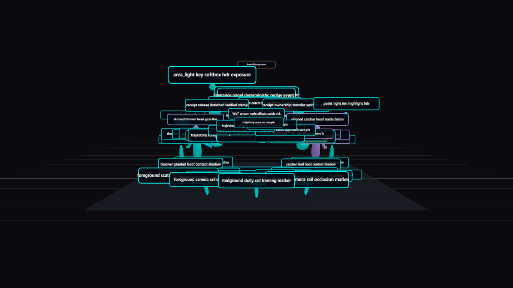
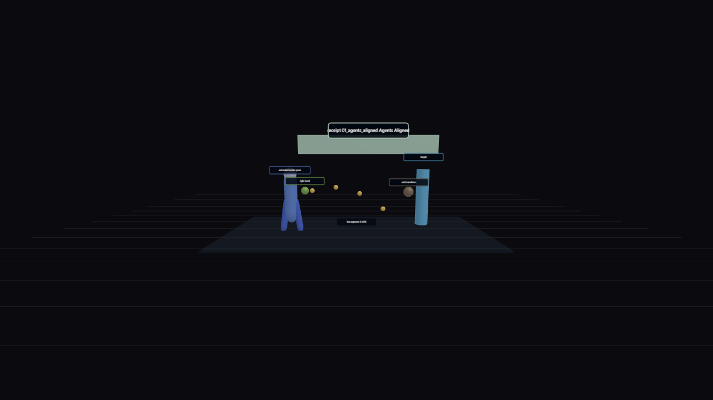
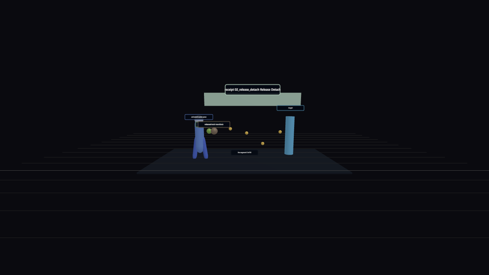
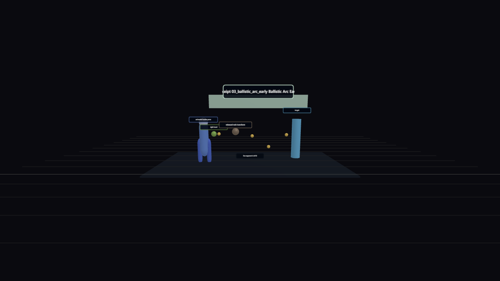
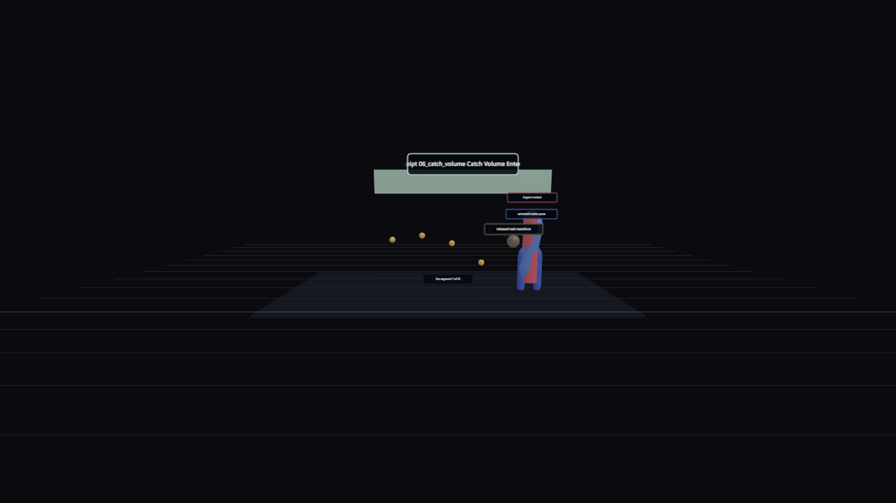
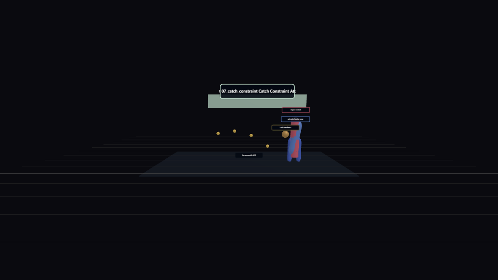
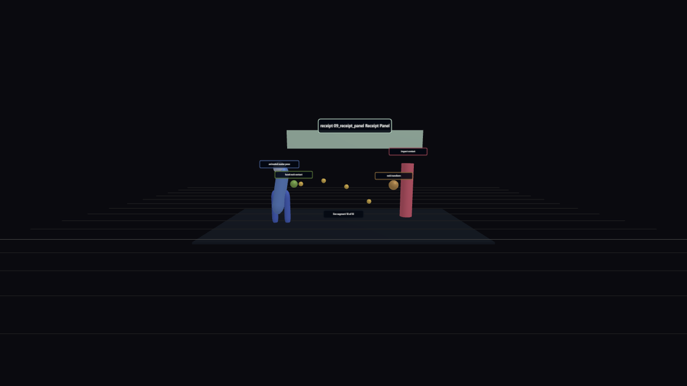

# Format Gauntlet Contact Sheet - two-agent-handoff-catch

Generated: 2026-06-21T02:04:41.260Z
Scorecard: [scorecard.json](scorecard.json)

| Segment | Mode | Oracle | Still |
| --- | --- | --- | --- |
| 00_scene_loaded | captured-scene-loaded | world-model-event-replay |  |
| 01_agents_aligned | live-segment-screenshot | live-segment-screenshot |  |
| 02_release_detach | live-segment-screenshot | live-segment-screenshot |  |
| 03_ballistic_arc_early | live-segment-screenshot | live-segment-screenshot |  |
| 04_ballistic_arc_mid | live-segment-screenshot | live-segment-screenshot |  |
| 05_ballistic_arc_late | live-segment-screenshot | live-segment-screenshot |  |
| 06_catch_volume | live-segment-screenshot | live-segment-screenshot |  |
| 07_catch_constraint | live-segment-screenshot | live-segment-screenshot |  |
| 08_ownership_transfer | live-segment-screenshot | live-segment-screenshot |  |
| 09_receipt_panel | live-segment-screenshot | live-segment-screenshot |  |
