# HoloScript Architecture

> Package dependency graph and layer rules for the monorepo.

## Dependency Graph

```mermaid
graph TB
  subgraph "L0 — Foundation"
    core-types["@holoscript/core-types<br/>Pure type definitions, zero runtime"]
    core["@holoscript/core<br/>Parser, AST, compilers, traits, identity"]
  end

  subgraph "L1 — Extracted Engine & Framework"
    engine["@holoscript/engine<br/>Rendering, physics, animation, ECS"]
    framework["@holoscript/framework<br/>Agent orchestration, BT, economy, swarm"]
    auth["@holoscript/auth<br/>Shared JWT auth for APIs"]
    agent-protocol["@holoscript/agent-protocol<br/>uAA2++ lifecycle, BaseService, PWG"]
  end

  subgraph "L2 — Language Tools"
    linter["@holoscript/linter<br/>Static analysis for .holo/.hsplus"]
    formatter["@holoscript/formatter<br/>Code formatting"]
    lsp["@holoscript/lsp<br/>Language Server Protocol"]
    wasm["@holoscript/wasm<br/>Rust WASM parser"]
  end

  subgraph "L3 — Runtime & Rendering"
    runtime["@holoscript/runtime<br/>Browser runtime, R3F, physics, events"]
    r3f["@holoscript/r3f-renderer<br/>Shared R3F components"]
    crdt["@holoscript/crdt<br/>Authenticated CRDTs for agent state"]
    snn["@holoscript/snn-webgpu<br/>GPU spiking neural networks"]
  end

  subgraph "L4 — Platform Services"
    absorb["@holoscript/absorb-service<br/>Codebase intelligence & self-improvement"]
    marketplace["@holoscript/marketplace-api<br/>Trait publishing & discovery"]
    collab["@holoscript/collab-server<br/>WebSocket relay for collaboration"]
    sandbox["@holoscript/security-sandbox<br/>VM sandbox for code execution"]
  end

  subgraph "L5 — Developer Surface"
    mcp["@holoscript/mcp-server<br/>MCP tools + JSON-RPC + REST"]
    cli["@holoscript/cli<br/>CLI: compile, validate, dev-serve"]
    studio["@holoscript/studio<br/>Next.js universal semantic IDE"]
    create["create-holoscript<br/>Zero-config project scaffolding"]
  end

  %% L0 internal
  core-types --> core

  %% L0 → L1
  core --> engine
  core --> framework
  framework --> agent-protocol

  %% L0 → L2
  core --> linter
  core --> formatter
  core --> lsp

  %% L0/L1 → L3
  core --> runtime
  core --> r3f

  %% L0/L1 → L4
  core --> absorb
  core --> marketplace
  auth --> marketplace

  %% L0-L4 → L5
  core --> mcp
  framework --> mcp
  absorb --> mcp
  core --> cli
  core --> studio
  absorb --> studio
  r3f --> studio
```

## Package Index

| Layer | Package                        | Version | Description                                              |
| ----- | ------------------------------ | ------- | -------------------------------------------------------- |
| L0    | `@holoscript/core-types`       | 7.0.0   | Pure type definitions, zero runtime deps                 |
| L0    | `@holoscript/core`             | 7.0.0   | Parser, AST, compilers (verify: `find packages -name '*Compiler.ts' -not -path '*/__tests__/*'`), trait system |
| L1    | `@holoscript/engine`           | 7.0.0   | Rendering, physics, animation, ECS (extracted from core) |
| L1    | `@holoscript/framework`        | 7.0.0   | Agent orchestration, BT, economy (extracted from core)   |
| L1    | `@holoscript/auth`             | 7.0.0   | JWT auth library (extracted from core)                   |
| L1    | `@holoscript/agent-protocol`   | 7.0.0   | uAA2++ agent lifecycle (extracted from core)             |
| L2    | `@holoscript/linter`           | 7.0.0   | Static analysis for .holo/.hsplus                        |
| L2    | `@holoscript/formatter`        | 3.1.0   | Code formatting                                          |
| L2    | `@holoscript/lsp`              | 7.0.0   | Language Server Protocol                                 |
| L2    | `@holoscript/compiler-wasm`    | 7.0.0   | Rust WASM parser                                         |
| L3    | `@holoscript/runtime`          | 7.0.0   | Browser runtime with R3F integration                     |
| L3    | `@holoscript/r3f-renderer`     | 7.0.0   | Shared React Three Fiber components                      |
| L3    | `@holoscript/crdt`             | 1.1.0   | Authenticated CRDTs for distributed state                |
| L3    | `@holoscript/snn-webgpu`       | 7.0.0   | GPU spiking neural networks                              |
| L4    | `@holoscript/absorb-service`   | 7.0.0   | Codebase intelligence pipeline                           |
| L4    | `@holoscript/marketplace-api`  | 1.2.3   | Trait marketplace                                        |
| L4    | `@holoscript/collab-server`    | 1.0.0   | WebSocket collaboration relay                            |
| L4    | `@holoscript/security-sandbox` | 1.2.2   | node:vm sandbox for safe execution (post-vm2 migration, see W.GOLD.193) |
| L5    | `@holoscript/mcp-server`       | 7.0.0   | MCP tools + REST API                                     |
| L5    | `@holoscript/cli`              | 7.0.0   | CLI: compile, validate, dev-serve                        |
| L5    | `@holoscript/studio`           | 7.0.0   | Next.js scene builder (private)                          |
| L5    | `create-holoscript`            | 1.4.0   | Zero-config scaffolding                                  |

## Dependency Rules

1. **No cycles.** Layers only depend downward (L5 -> L4 -> ... -> L0).
2. **`core-types` is the bottom.** Pure types, zero runtime. Everything can depend on it.
3. **`core` is the gravity well.** Most packages depend on it. Keep it lean.
4. **Extracted packages (L1) match core's major version** (currently 7.x).
5. **Domain vocabulary stays in plugins**, never in core (`packages/plugins/`).
6. **`workspace:*`** for internal deps. Never pin internal versions.
7. **Core↔Engine Boundary:** `@holoscript/core` (L0) must never have a runtime dependency on `@holoscript/engine` (L1). The runtime mutual dependency cycle is explicitly severed. Any shared types must be extracted to `core-types` or imported as `import type`.
