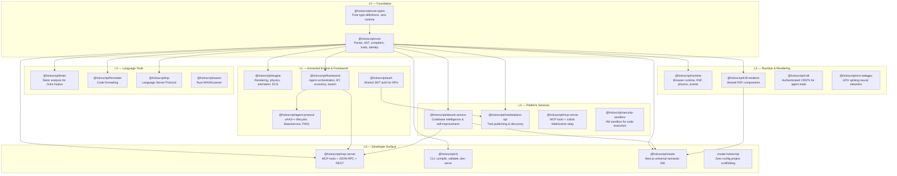

# HoloScript Architecture

> Package dependency graph and layer rules for the monorepo.

## Dependency Graph

```mermaid
graph TB
  subgraph "L0 — Foundation"
    core-types["@holoscript/core-types<br/>Pure type definitions, zero runtime"]
    core["@holoscript/core<br/>Parser, AST, compilers, traits, identity"]
  end

  subgraph "L1 — Extracted Engine & Framework"
    engine["@holoscript/engine<br/>Rendering, physics, animation, ECS"]
    framework["@holoscript/framework<br/>Agent orchestration, BT, economy, swarm"]
    auth["@holoscript/auth<br/>Shared JWT auth for APIs"]
    agent-protocol["@holoscript/agent-protocol<br/>uAA2++ lifecycle, BaseService, PWG"]
  end

  subgraph "L2 — Language Tools"
    linter["@holoscript/linter<br/>Static analysis for .holo/.hsplus"]
    formatter["@holoscript/formatter<br/>Code formatting"]
    lsp["@holoscript/lsp<br/>Language Server Protocol"]
    wasm["@holoscript/wasm<br/>Rust WASM parser"]
  end

  subgraph "L3 — Runtime & Rendering"
    runtime["@holoscript/runtime<br/>Browser runtime, R3F, physics, events"]
    r3f["@holoscript/r3f-renderer<br/>Shared R3F components"]
    crdt["@holoscript/crdt<br/>Authenticated CRDTs for agent state"]
    snn["@holoscript/snn-webgpu<br/>GPU spiking neural networks"]
  end

  subgraph "L4 — Platform Services"
    absorb["@holoscript/absorb-service<br/>Codebase intelligence & self-improvement"]
    marketplace["@holoscript/marketplace-api<br/>Trait publishing & discovery"]
    collab["@holoscript/mcp-server<br/>MCP tools + collab WebSocket relay"]
    sandbox["@holoscript/security-sandbox<br/>VM sandbox for code execution"]
  end

  subgraph "L5 — Developer Surface"
    mcp["@holoscript/mcp-server<br/>MCP tools + JSON-RPC + REST"]
    cli["@holoscript/cli<br/>CLI: compile, validate, dev-serve"]
    studio["@holoscript/studio<br/>Next.js universal semantic IDE"]
    create["create-holoscript<br/>Zero-config project scaffolding"]
  end

  %% L0 internal
  core-types --> core

  %% L0 → L1
  core --> engine
  core --> framework
  framework --> agent-protocol

  %% L0 → L2
  core --> linter
  core --> formatter
  core --> lsp

  %% L0/L1 → L3
  core --> runtime
  core --> r3f

  %% L0/L1 → L4
  core --> absorb
  core --> marketplace
  auth --> marketplace

  %% L0-L4 → L5
  core --> mcp
  framework --> mcp
  absorb --> mcp
  core --> cli
  core --> studio
  absorb --> studio
  r3f --> studio
```

## Package Index

Package versions are intentionally omitted here. They are lane-managed and can
diverge across packages; read each `package.json` before citing a version.

| Layer | Package                        | Description                                                                                                    |
| ----- | ------------------------------ | -------------------------------------------------------------------------------------------------------------- |
| L0    | `@holoscript/core-types`       | Pure type definitions, zero runtime deps                                                                       |
| L0    | `@holoscript/core`             | Parser, AST, compilers (verify: `find packages -name '*Compiler.ts' -not -path '*/__tests__/*'`), trait system |
| L1    | `@holoscript/engine`           | Rendering, physics, animation, ECS (extracted from core)                                                       |
| L1    | `@holoscript/framework`        | Agent orchestration, BT, economy (extracted from core)                                                         |
| L1    | `@holoscript/auth`             | JWT auth library (extracted from core)                                                                         |
| L1    | `@holoscript/agent-protocol`   | uAA2++ agent lifecycle (extracted from core)                                                                   |
| L2    | `@holoscript/linter`           | Static analysis for .holo/.hsplus                                                                              |
| L2    | `@holoscript/formatter`        | Code formatting                                                                                                |
| L2    | `@holoscript/lsp`              | Language Server Protocol                                                                                       |
| L2    | `@holoscript/compiler-wasm`    | Rust WASM parser                                                                                               |
| L3    | `@holoscript/runtime`          | Browser runtime with R3F integration                                                                           |
| L3    | `@holoscript/r3f-renderer`     | Shared React Three Fiber components                                                                            |
| L3    | `@holoscript/crdt`             | Authenticated CRDTs for distributed state                                                                      |
| L3    | `@holoscript/snn-webgpu`       | GPU spiking neural networks                                                                                    |
| L4    | `@holoscript/absorb-service`   | Codebase intelligence pipeline                                                                                 |
| L4    | `@holoscript/marketplace-api`  | Trait marketplace                                                                                              |
| L4    | `@holoscript/mcp-server`       | MCP tools + REST API + WebSocket collab relay                                                                  |
| L4    | `@holoscript/security-sandbox` | node:vm sandbox for safe execution (post-vm2 migration, see W.GOLD.193)                                        |
| L5    | `@holoscript/mcp-server`       | MCP tools + REST API                                                                                           |
| L5    | `@holoscript/cli`              | CLI: compile, validate, dev-serve                                                                              |
| L5    | `@holoscript/studio`           | Next.js scene builder (private)                                                                                |
| L5    | `create-holoscript`            | Zero-config scaffolding                                                                                        |

## Dependency Rules

1. **No cycles.** Layers only depend downward (L5 -> L4 -> ... -> L0).
2. **`core-types` is the bottom.** Pure types, zero runtime. Everything can depend on it.
3. **`core` is the gravity well.** Most packages depend on it. Keep it lean.
4. **Extracted packages (L1) should track core's major-version lane.** Verify
   the current package majors in `package.json` before citing them.
5. **Domain vocabulary stays in plugins**, never in core (`packages/plugins/`).
6. **`workspace:*`** for internal deps. Never pin internal versions.
7. **Core↔Engine Boundary:** `@holoscript/core` (L0) must never have a runtime dependency on `@holoscript/engine` (L1). The runtime mutual dependency cycle is explicitly severed. Any shared types must be extracted to `core-types` or imported as `import type`.

> **Rules 1 and 7 are enforced by `scripts/holo-ci/check-workspace-acyclic.mjs`**
> (pre-commit Gate 5g7). Until 2026-08-05 they had no gate, which is how commit
> `7f2ba28b3` silently reverted `b53e815f9` and left the workspace unbuildable
> from a clean checkout. The gate covers three defect classes, because acyclicity
> alone does not guarantee a build order exists:
>
> 1. **cycles** over `workspace:`-spec edges, across all four dependency fields —
>    `devDependencies` participate in pnpm's ordering, and that is exactly how
>    core closed the 11-package cycle;
> 2. **build-order inversions that are not cycles** — a semver back-edge creates
>    no pnpm edge, so `A --workspace--> B` plus `B --semver--> A` plus a `--dts`
>    build in B inverts the order with no cycle to detect;
> 3. **unordered build-time deps** — a sibling needed for type emit but declared
>    only with a semver range gives pnpm no ordering constraint at all. This is
>    what deleting a cycle edge leaves behind, so fixing rule 1 carelessly
>    *creates* this one.
>
> Note the interaction with rule 6: a build-time need on a sibling must be
> declared `workspace:` (devDependencies is the honest field). A semver
> `peerDependencies` entry remains correct for what a published consumer must
> supply — it is simply not an ordering declaration. Both can coexist on the same
> sibling, and for 16 packages they now do.
> Full analysis: `decisions/2026-08-05_workspace-build-cycle.md` in `holo-dev`.
