# HoloScript

Absorb any codebase. Build anything — APIs, agents, smart contracts, simulations, web apps, VR worlds. Deploy agents that run without you.

```json
{
  "mcpServers": {
    "holoscript": {
      "command": "npx",
      "args": ["-y", "mcp-remote", "https://mcp.holoscript.net/mcp"]
    }
  }
}
```

## The Flow

### 1. Absorb — Understand any codebase

Point Absorb at any repo. It scans the code, builds a knowledge graph, and answers questions about it.

```bash
# Scan
absorb_run_absorb({ repo: "https://github.com/your/repo" })

# Ask
holo_ask_codebase({ query: "how does auth work?" })
# → Returns: cited answer with file:line references

# Improve
absorb_run_improve({ profile: "quick" })
# → Returns: auto-fix patches for type errors, lint, coverage gaps
```

| Tool | What it does | Cost |
| ---- | ------------ | ---- |
| `holo_absorb_repo` | Scan repo → knowledge graph (TS, Python, Rust, Go) | Free |
| `holo_ask_codebase` | Natural language Q&A with file:line citations | Free |
| `holo_impact_analysis` | "What breaks if I change X?" | Free |
| `holo_semantic_search` | Vector search over symbols + docs | Free |
| `absorb_extract_knowledge` | Auto-generate patterns/wisdoms from code | Credits |
| `absorb_run_improve` | Auto-fix type errors, lint, coverage | 25-150 credits |
| `absorb_run_pipeline` | Recursive self-improvement (L0 fix → L1 learn → L2 evolve) | Budget-capped |

28 MCP tools total. Production service at `absorb.holoscript.net`. [Absorb docs →](./packages/absorb-service/README.md)

### 2. Build — 12 sovereign compilers, 12 bridges

24 compilers. Two kinds.

**Sovereign compilers** define what the platform natively IS — agent identity, neural computation, mathematical physics, digital twins, trait composition, real-time state. They don't translate for hardware. They expand the platform's native reality.

**Bridge compilers** translate sovereign output into Unity, Unreal, Godot, React, WebGPU, VRChat, and 21 other legacy targets. They're useful. They're not the story.

#### The sovereign layer

| You write | What the compiler produces | Why it matters |
| --------- | ------------------------- | -------------- |
| `@protocol @lifecycle` | A2A Agent Card — identity, economy, W/P/G memories | Agents carry their full state across the mesh |
| `@LIF_Neuron @synapse` | Neural IR → WGSL GPU compute shaders (1,855 LOC compiler) | Deep learning runs natively on GPU, no Python |
| `@sdf_sphere @sdf_union` | GLSL ray march shaders (22 primitives, 6 CSG ops) | Infinite-resolution shapes from math, no polygons |
| `@joint_revolute @urdf` | URDF/SDF robot descriptions — joints, sensors, transmissions | ROS 2 / Gazebo, what a thing IS, not how it looks |
| `@iot_sensor @digital_twin` | Azure DTDL — properties, commands, telemetry | Real-world semantic data |
| `@physics(mass: 5)` | USD Physics — rigid body, collision, scene graph | Pixar's universal scene standard |

#### The bridge layer

| You write | Compiler outputs | Use case |
| --------- | ---------------- | -------- |
| `@physics @grabbable` | Unity C#, Unreal C++, Godot GDScript | VR/AR/games |
| `@endpoint @auth` | Express/Fastify API + Dockerfile | Backend services |
| `@royalty @lazy_mint` | Solidity + multi-chain deploy scripts | NFT/DeFi |
| `@panel @button @form` | React TSX + Tailwind CSS | Web applications |
| `@shader @compute` | WGSL vertex/fragment/compute | GPU programming |
| `@causal @intervention` | Structural Causal Model DAG | ML research |

Same trait system. Same compiler architecture. `@physics(mass: 5)` becomes a Unity `Rigidbody`, an Unreal `UPhysicsConstraintComponent`, or a URDF `<inertial>` — deterministic output, every time. The sovereign compilers define the truth. The bridges carry it. ([Why this matters →](./docs/strategy/research/2026-03-11_executable-semantics-symbol-grounding-whitepaper.md))

```holo
composition "Hello" {
  object "Cube" {
    @grabbable
    @physics
    geometry: "box"
    position: [0, 1, 0]
  }
}
```

```bash
holoscript compile hello.holo --target unity    # bridge: Unity C#
holoscript compile hello.holo --target urdf     # sovereign: ROS 2 robot
holoscript compile hello.holo --target nir      # sovereign: neural IR → GPU
```

177 MCP tools total (149 holoscript + 28 absorb). 658 trait handlers across 114 categories. Three file formats: `.holo` (declarative scenes), `.hs` (templates + behaviors), `.hsplus` (full TypeScript for XR). [Format guide →](./docs/guides/file-formats.md)

### 3. Run — What executes at runtime

The compiler gets your code to the platform. The runtime IS the platform.

**Two parallel VMs:**

| VM | What it does | Speed |
| -- | ------------ | ----- |
| **HoloVM** | Spatial execution — entities, transforms, physics, rendering | 60-90 Hz |
| **uAAL VM** | Cognitive agent cycles — perceive, decide, learn, evolve | 2-10 Hz |

The vm-bridge connects them: agents perceive the 3D world, make decisions at cognitive frequency, and queue mutations that execute on the next spatial tick.

**GPU compute (WebGPU):**

| System | Scale | What you see |
| ------ | ----- | ------------ |
| MLS-MPM Fluid | 10K+ particles | Real-time water, mud, sand with deformation |
| Particle Physics | 100K+ particles | Fire, smoke, rain, destruction |
| Gaussian Splats | 500K+ sorted | Photogrammetry point clouds |
| SNN Neurons | 10K @ 60Hz | Spiking neural networks on GPU |
| Ocean FFT | 2048x2048 | Physically-accurate waves, foam, caustics |
| Instancing | 1M+ shapes | 6 draw calls for massive scenes |

**32 renderers** — subsurface skin scattering, refractive eyes, anisotropic hair, volumetric clouds, screen-space GI, 9-stage post-processing pipeline. [Renderer list →](./packages/r3f-renderer/README.md)

**Persistent services that run without you:**

| Service | What it does |
| ------- | ------------ |
| Absorb Daemon | Scans code, identifies issues, generates fixes, runs tests |
| HoloMesh Discovery | P2P agent discovery with gossip propagation |
| HoloMesh CRDT | Neuroscience-inspired memory — hot buffer → cold store, active forgetting |
| x402 Facilitator | Dual-settlement payments: in-memory (<$0.10) + on-chain USDC (Base/Solana) |
| Behavior Tree Engine | Tick-based NPC/agent decisions: Sequence, Selector, GOAP planning |
| WebSocket Transport | Auto-reconnect, room isolation, delta compression |
| Self-Healing | Autonomous error recovery |

**Deploy autonomous agents:**

| Platform     | What agents do                                               | Entry point                          |
| ------------ | ------------------------------------------------------------ | ------------------------------------ |
| **HoloMesh** | Trade knowledge, build reputation, join bounty teams         | `POST /api/holomesh/quickstart`      |
| **Moltbook** | Post, comment, follow, earn karma on AI social network       | `POST www.moltbook.com/api/v1/posts` |
| **Custom**   | Compile to Node.js services, deploy anywhere                 | `--target node-service`              |

### Studio — Visual IDE

36 pages. 43 panels. 5 editing modes (Creator, Artist, Filmmaker, Expert, Character). AI scene generation via Brittney. Real-time multiplayer editing (CRDT). VR editing in Quest 3 / Vision Pro. Export to GLB/GLTF/USD/FBX. [Studio docs →](./packages/studio/README.md)

### Agent Identity & Security

15,079 LOC across 24 files. Every agent has a passport, keys, and capabilities.

| Component | What it does |
| --------- | ------------ |
| `AgentPassport` | DID-based identity with state snapshot, compressed memory, and delegation chain |
| `CapabilityToken` | UCAN 0.10.0 tokens — Ed25519 signed, attenuated capabilities, proof chains |
| `CapabilityRBAC` | Dual-mode access control: UCAN capability-first or legacy JWT RBAC-first |
| `AgentCommitSigner` | Ed25519 signatures on code changes with SHA-256 change-set digest |
| `HybridSigner` | Ed25519 + ML-DSA post-quantum dual signatures with key rotation |
| `SpatialMemoryZones` | Per-zone memory access control for spatial environments |
| `ConfabulationValidator` | Detects when agents fabricate provenance claims |
| `PopMiddleware` | Proof-of-Play computation attestation |
| `SkillSandbox` | VM-isolated skill execution with capability-gated I/O |

[Identity source →](./packages/core/src/compiler/identity/)

### 21 Domain Block Compilers

`DomainBlockCompilerMixin` (4,614 LOC) generates domain-specific code from `.holo` domain blocks. Each domain gets its own typed output:

| Domain | Output | Use case |
| ------ | ------ | -------- |
| Healthcare | HL7 FHIR resources, DICOM refs | Medical simulations, patient portals |
| Robotics | ROS 2 action servers, joint configs | Robot training, digital twins |
| IoT | MQTT topics, device shadows, telemetry | Smart buildings, agriculture |
| Education | LTI launch configs, SCORM packages | Interactive courseware |
| Music | MIDI sequences, audio graphs | Generative music, performances |
| Architecture | IFC entities, BIM metadata | Building design, walkthroughs |
| Web3 | Solidity stubs, token metadata | NFT minting, DeFi integrations |
| DataViz | D3/Vega specs, chart configs | Dashboards, spatial analytics |
| Procedural | L-system rules, wave function collapse | Terrain, vegetation, cities |
| Navigation | NavMesh configs, pathfinding graphs | NPC movement, crowd simulation |
| Rendering | Shader pipelines, material graphs | Custom visual effects |
| Weather | Atmospheric models, cloud systems | Environmental simulation |
| Narrative | Dialogue trees, story arcs | Interactive fiction, NPC conversations |
| Payment | x402 flows, credit gates | Commerce, micropayments |
| Physics | Constraint systems, force fields | Advanced physics simulation |
| Material | PBR pipelines, texture graphs | Surface appearance |
| Particle | Emitter configs, force profiles | VFX, environmental effects |
| PostProcessing | Bloom, SSAO, tone mapping chains | Visual post-processing |
| AudioSource | Spatial audio, reverb zones | 3D sound design |
| Input | Controller bindings, gesture maps | Cross-platform input |
| Domain (generic) | Passthrough for custom domain blocks | Plugin extensibility |

[Source →](./packages/core/src/compiler/DomainBlockCompilerMixin.ts)

### 32 React Three Fiber Renderers

Production 3D rendering components. Each is a standalone R3F component:

`AgentRoomRenderer` `AnimatedMeshNode` `AtmosphereRenderer` `BadgeHolographicRenderer` `CloudRenderer` `DraftMeshNode` `EyeRenderer` `FluidRenderer` `GIRenderer` `GaussianSplatViewer` `GodRaysEffect` `GuestbookRenderer` `HairRenderer` `HologramGif` `HologramImage` `HologramVideo` `LODMeshNode` `MeshNode` `OceanRenderer` `PostProcessingRenderer` `ProceduralMesh` `ProgressiveLoader` `QuiltViewer` `RoomPortalRenderer` `ScalarFieldOverlay` `ShaderMeshNode` `ShapePoolRenderer` `SkinSSRenderer` `SpatialAudioRenderer` `SpatialFeedRenderer` `TerrainRenderer` `VFXParticleRenderer`

7,396 LOC total. Includes subsurface skin scattering, refractive eyes, anisotropic hair, volumetric clouds, Gaussian splat viewing, LOD streaming, and 9-stage post-processing. [Renderer source →](./packages/r3f-renderer/src/components/)

### Additional Packages

| Package | What it does | LOC |
| ------- | ------------ | --- |
| `@holoscript/snn-webgpu` | GPU-accelerated spiking neural networks. 10K neurons @ 60Hz via WebGPU compute shaders. | 9,524 |
| `@holoscript/wasm` | Rust WASM parser for 10x faster .holo parsing in browsers. | 3,154 |
| `tree-sitter-holoscript` | tree-sitter grammar with LSP integration + pre-compiled WASM. Editor plugin support. | 25 files |

## What's Here

| Metric          | Value                                                      | How to verify                           |
| --------------- | ---------------------------------------------------------- | --------------------------------------- |
| MCP tools       | 177 (149 holoscript + 28 absorb)                           | `curl mcp.holoscript.net/api/health`    |
| Compile targets | 24 compilers (12 sovereign + 12 bridge), 29 ExportTargets  | 51/51 benchmark, 0.7ms avg              |
| Runtime VMs     | 2 (HoloVM spatial + uAAL cognitive)                        | `packages/holo-vm` + `packages/uaal`    |
| GPU systems     | 6 WebGPU compute pipelines                                 | `packages/core/src/gpu/shaders/`        |
| Renderers       | 32 React Three Fiber components                            | `packages/r3f-renderer/src/components/` |
| Traits          | 658 trait handlers                                         | MCP: `list_traits` / `suggest_traits`   |
| Packages        | 78 (72 + 6 services)                                       | pnpm workspaces                         |
| Tests           | 57,356+ passing                                            | `pnpm test`                             |
| Examples        | 324 files                                                  | [Browse catalog →](./examples/INDEX.md) |
| Knowledge store | 676 entries across 10 domains                              | `curl .../health`                       |

No vendor lock-in. [Hololand](https://github.com/brianonbased-dev/Hololand) uses the same public APIs as everyone else.


---

## Use Cases

| Use Case                  | Description                                               | View Example                                                           |
| ------------------------- | --------------------------------------------------------- | ---------------------------------------------------------------------- |
| 🏢 **Corporate Training** | VR safety training with interactive hazard identification | [VR Training Simulation →](./examples/general/vr-training-simulation/) |
| 🛋️ **E-Commerce AR**      | "Try before you buy" furniture preview on mobile          | [AR Furniture Preview →](./examples/general/ar-furniture-preview/)     |
| 🎨 **Museums & Culture**  | Virtual art gallery with audio guides                     | [Virtual Art Gallery →](./examples/general/virtual-art-gallery/)       |
| 🎮 **Gaming**             | Fast-paced VR shooter with physics and AI                 | [VR Game Demo →](./examples/general/vr-game-demo/)                     |
| 🤖 **Robotics**           | Industrial robot arm with ROS2/Gazebo export              | [Robotics Simulation →](./examples/specialized/robotics/)              |
| 🏭 **IoT/Industry**       | Smart factory digital twin with Azure integration         | [IoT Digital Twin →](./examples/specialized/iot/)                      |
| 👥 **Multiplayer**        | Collaborative VR meeting space with voice chat            | [Multiplayer VR →](./examples/specialized/multiplayer/)                |
| 📱 **Quest/Mobile**       | Platform-optimized VR with Quest 2/3 features             | [Unity Quest →](./examples/specialized/unity-quest/)                   |
| 🌐 **Social VR**          | VRChat world with mirrors, video, and Udon#               | [VRChat World →](./examples/specialized/vrchat/)                       |

**[View all 324 examples →](./examples/)** | **[Browse examples catalog →](./examples/INDEX.md)**

---

## 📦 Installation

### MCP (recommended — works with Claude, Cursor, any MCP client)

```json
{
  "mcpServers": {
    "holoscript": {
      "command": "npx",
      "args": ["-y", "mcp-remote", "https://mcp.holoscript.net/mcp"]
    }
  }
}
```

### npm

```bash
npm install @holoscript/core
```

### Compile API (no install)

```bash
curl -X POST https://mcp.holoscript.net/api/compile \
  -H "Content-Type: application/json" \
  -d '{"code": "composition \"Hello\" { object \"Cube\" { geometry: \"box\" } }", "target": "r3f"}'
```

---

## Three Formats, One Stack

HoloScript provides **three specialized file formats** that work independently or together:

### `.holo` — Scene Graph

Declarative world compositions with environments, NPC dialogs, quests, and multiplayer networking.

```holo
composition "VR Escape Room" {
  environment {
    ambient_light: 0.1
    fog: { enabled: true, color: "#111122", density: 0.05 }
  }

  spatial_group "Puzzle1_CombinationLock" {
    object "SafeBox" {
      geometry: "model/safe.glb"
      state { locked: true, combination: [7, 2, 5] }
    }

    object "Dial1" {
      @clickable
      @rotatable
      onClick: {
        this.state.value = (this.state.value + 1) % 10
        checkCombination()
      }
    }
  }
}
```

### `.hs` — Core Language

Templates, agent behaviors with spatial awareness, IoT data streams, logic gates, and reusable components.

```hs
// Guard agent with spatial awareness and patrol
template "GuardAgent" {
  @agent { type: "guard", capabilities: ["patrol", "combat", "alert"] }
  @spatialAwareness { detection_radius: 15, track_agents: true }
  @patrol {
    zone: "TreasureRoom"
    waypoints: [[-45,1,-55], [-55,1,-55], [-55,1,-45], [-45,1,-45]]
    speed: 2
  }

  on entityNearby(entity, layer) {
    if (entity.type == "player" && !entity.hasAccess) {
      broadcast("guard_channel", { type: "intruder_detected", location: entity.position })
      moveTo(entity.position)
    }
  }
}

// IoT data pipeline
stream TemperatureData from IoTSensor {
  filter: value > 0
  transform: celsius_to_fahrenheit
  aggregate: moving_average(window: 10)
}
```

### `.hsplus` — TypeScript for XR

Full programming language with modules, types, physics, joints, state machines, and async/await.

```hsplus
module GameState {
  export let score: number = 0;
  export let ballsRemaining: number = 3;

  export function addScore(points: number) {
    score += points * multiplier;
    emit("score_changed", score);
  }
}

module PinballPhysics {
  const BALL_MASS = 0.08;          // kg
  const FLIPPER_SPEED = 1700;      // degrees/sec

  export interface BallState {
    position: Vector3;
    velocity: Vector3;
  }

  export function applyTableGravity(ball: BallState, dt: number) {
    ball.velocity.z += GRAVITY * Math.sin(tiltRad) * dt;
  }
}
```

### How They Work Together

```text
my-vr-game/
├── main.holo              # Scene graph — world composition (compile entry point)
├── agents/
│   ├── guard.hs           # Core language — patrol AI, spatial awareness
│   └── npc.hs             # Core language — NPC behaviors
├── components/
│   ├── combat.hsplus      # TypeScript for XR — physics, damage calculations
│   └── inventory.hsplus   # TypeScript for XR — state management
└── scenes/
    ├── arena.holo         # Scene graph — combat arena layout
    └── lobby.holo         # Scene graph — multiplayer lobby
```

**[📄 Full File Types Guide →](./docs/guides/file-formats.md)**

---

## 🏆 vs Competitors

| vs                      | HoloScript Advantage                                                                       |
| ----------------------- | ------------------------------------------------------------------------------------------ |
| **C# (Unity)**          | Built-in spatial primitives, 33 targets vs 1, agent SDK with spatial awareness            |
| **Blueprints (Unreal)** | Text-based (version control friendly), three formats for different domains, cross-platform |
| **GDScript (Godot)**    | Strong typing in `.hsplus`, module system, spatial query API, LSP tooling                  |
| **Swift (visionOS)**    | Not locked to Apple, 33 targets, agent choreography, IoT/robotics export                  |

---

## 🔥 Why HoloScript?

### 1. Universal Semantic Traits

HoloScript's 658 trait handlers (357 trait files, 115 category modules) describe **any domain entity** — not just 3D:

- **Spatial**: `@physics`, `@grabbable`, `@anchor`, `@spatial_audio`
- **AI/Agents**: `@protocol`, `@lifecycle`, `@knowledge`, `@llm_agent`
- **Services**: `@http`, `@circuit_breaker`, `@auth`, `@rate_limit`
- **IoT**: `@iot_sensor`, `@digital_twin`, `@mqtt_bridge`
- **Economy**: `@credit`, `@marketplace`, `@escrow`

The trait system is a **semantic vocabulary**. The compiler translates it to platform-specific code.

### 2. Ecosystem Architecture

```mermaid
flowchart TD
    classDef foundation fill:#c0392b,color:#fff,stroke:#1a1a2e,stroke-width:2px;
    classDef foundation_sub fill:#2c3e50,color:#ecf0f1,stroke:#1a1a2e;
    classDef language fill:#1a5276,color:#aed6f1,stroke:#0f3460;
    classDef runtime fill:#2d6a4f,color:#b7e4c7,stroke:#1b4332;
    classDef ai fill:#3d3d5c,color:#c4b5fd,stroke:#2d2d44;
    classDef devtools fill:#6b2d5b,color:#f0a6ca,stroke:#4a1942;
    classDef connectors fill:#2a5a2a,color:#90ee90,stroke:#1a3a1a;
    classDef studio fill:#69140e,color:#f8d7da,stroke:#3c1518;
    classDef marketplace fill:#3d3d5c,color:#c4b5fd,stroke:#2c2c3e;

    subgraph Foundation ["Foundation"]
        F_core("@holoscript/core"):::foundation
        F_crdt("@holoscript/crdt"):::foundation_sub
        F_std("@holoscript/std"):::foundation_sub
        F_auth("@holoscript/auth"):::foundation_sub
    end

    subgraph Language ["Language & Tooling"]
        L_parser("parser"):::language
        L_traits("traits"):::language
        L_compiler("compiler"):::language
        L_linter("linter"):::language
        L_lsp("lsp"):::language
        L_formatter("formatter"):::language
    end

    subgraph Runtime ["Runtime & Engine"]
        R_engine("engine"):::runtime
        R_runtime("runtime"):::runtime
        R_holovm("holo-vm"):::runtime
        R_uaal("uaal"):::runtime
        R_vmbridge("vm-bridge"):::runtime
    end

    subgraph AI ["AI & Intelligence"]
        A_intel("intelligence"):::ai
        A_llm("llm-provider"):::ai
        A_val("ai-validator"):::ai
    end

    subgraph DevTools ["Developer Tools"]
        D_cli("cli"):::devtools
        D_mcp("mcp-server"):::devtools
        D_vscode("vscode-extension"):::devtools
        D_bench("benchmark"):::devtools
        D_sdk("sdk"):::devtools
    end

    subgraph Connectors ["Studio Integration Hub"]
        C_core("connector-core"):::connectors
        C_github("connector-github"):::connectors
        C_railway("connector-railway"):::connectors
        C_upstash("connector-upstash"):::connectors
        C_appstore("connector-appstore"):::connectors
    end

    subgraph Studio ["Studio & Web"]
        S_studio("studio"):::studio
        S_r3f("r3f-renderer"):::studio
        S_sdk("studio-plugin-sdk"):::studio
        S_play("playground"):::studio
    end

    subgraph Marketplace ["Marketplace"]
        M_graphql("graphql-api"):::marketplace
        M_api("marketplace-api"):::marketplace
        M_web("marketplace-web"):::marketplace
        M_reg("registry"):::marketplace
    end

    %% Dependency Edges
    F_core --> F_crdt

    L_parser --> F_core
    L_traits --> F_core
    L_linter --> F_core
    L_compiler --> F_core
    L_compiler --> L_traits
    L_compiler --> L_parser
    L_lsp --> F_core
    L_lsp --> L_linter

    R_engine --> F_core
    R_runtime --> F_core
    R_holovm --> F_core
    R_vmbridge --> R_holovm
    R_vmbridge --> R_uaal

    A_intel --> F_core
    A_val --> F_core

    D_cli --> F_core
    D_cli --> A_llm
    D_cli --> D_sdk
    D_mcp --> F_core
    D_mcp --> A_llm
    D_vscode --> D_sdk
    D_vscode --> L_lsp
    D_vscode --> L_formatter
    D_bench --> F_core
    D_bench --> L_formatter
    D_bench --> L_lsp

    C_github --> C_core
    C_railway --> C_core
    C_upstash --> C_core
    C_appstore --> C_core

    S_studio --> F_core
    S_studio --> S_r3f
    S_studio --> F_std
    S_studio --> S_sdk
    S_r3f --> F_core
    S_play --> F_core
    S_play --> F_std

    M_graphql --> F_auth
    M_graphql --> F_core
    M_api --> F_auth
    M_api --> F_core
    M_api --> M_reg
    M_web --> M_api
```



### Monorepo Map

With **68 packages** organized into specialized domain boundaries, HoloScript uses `pnpm workspaces` to manage interdependencies. The primary packages are classified as follows:

| Layer           | Primary Packages                                                                                                 | Path Location                                                                                                                                                                                                                                                                                                      |
| --------------- | ---------------------------------------------------------------------------------------------------------------- | ------------------------------------------------------------------------------------------------------------------------------------------------------------------------------------------------------------------------------------------------------------------------------------------------------------------ |
| **Foundation**  | The bedrock of the system: `@holoscript/core` (types, traits, abstract compilers), CRDT state, standard library. | [`packages/core`](./packages/core) • [`packages/crdt`](./packages/crdt) • [`packages/std`](./packages/std) • [`packages/auth`](./packages/auth)                                                                                                                                                                    |
| **Language**    | Handling `.hs`, `.hsplus`, `.holo` files via AST parsing, linters, the LSP server, and trait compilation.        | [`packages/parser`](./packages/parser) • [`packages/traits`](./packages/traits) • [`packages/compiler`](./packages/compiler) • [`packages/lsp`](./packages/lsp) • [`packages/linter`](./packages/linter) • [`packages/formatter`](./packages/formatter)                                                            |
| **Runtime**     | Headless execution, native Spatial VM state trees, and Cognitive OS (uAAL) bridge processing.                    | [`packages/engine`](./packages/engine) • [`packages/runtime`](./packages/runtime) • [`packages/holo-vm`](./packages/holo-vm) • [`packages/uaal`](./packages/uaal) • [`packages/vm-bridge`](./packages/vm-bridge)                                                                                                   |
| **AI Layer**    | Ecosystem MCP configurations, AI hallucination validators, and LLM provider SDK shims.                           | [`packages/intelligence`](./packages/intelligence) • [`packages/llm-provider`](./packages/llm-provider) • [`packages/ai-validator`](./packages/ai-validator)                                                                                                                                                       |
| **Dev Tools**   | Node.js CLIs (`holoscript`), VSCode extension, Benchmarking utilities, and the native SDKs.                      | [`packages/cli`](./packages/cli) • [`packages/mcp-server`](./packages/mcp-server) • [`packages/vscode-extension`](./packages/vscode-extension) • [`packages/benchmark`](./packages/benchmark) • [`packages/sdk`](./packages/sdk)                                                                                   |
| **Connectors**  | Dedicated integration layers for 3rd-party services (GitHub repos, Railway deployments, Upstash caches).         | [`packages/connector-core`](./packages/connector-core) • [`packages/connector-github`](./packages/connector-github) • [`packages/connector-railway`](./packages/connector-railway) • [`packages/connector-upstash`](./packages/connector-upstash) • [`packages/connector-appstore`](./packages/connector-appstore) |
| **Studio**      | WebGL/R3F rendering pipelines, full React Studio authoring interfaces, and web playgrounds.                      | [`packages/studio`](./packages/studio) • [`packages/r3f-renderer`](./packages/r3f-renderer) • [`packages/studio-plugin-sdk`](./packages/studio-plugin-sdk) • [`packages/playground`](./packages/playground)                                                                                                        |
| **Marketplace** | Agent-to-Agent settlement gateways, spatial object registries, and GraphQL access nodes.                         | [`packages/graphql-api`](./packages/graphql-api) • [`packages/marketplace-api`](./packages/marketplace-api) • [`packages/marketplace-web`](./packages/marketplace-web) • [`packages/registry`](./packages/registry)                                                                                                |

### 3. Three-Format Architecture

HoloScript provides **three specialized languages** that work together:

- **`.holo` (Scene Graph)**: Declarative world compositions — environments, NPC dialogs, quests, multiplayer networking, portals
- **`.hs` (Core Language)**: Templates, agent behaviors, spatial awareness, IoT streams, gates, utility functions
- **`.hsplus` (TypeScript for XR)**: Full programming language — modules, types, physics, joints, state machines, async/await

**Plus**: Runtime execution (ThreeJSRenderer, 120K particles, PBR materials, post-processing, weather systems) and multi-target compilation to 33 targets.

### 4. Even Playing Field (Commons-Based)

We built [Hololand](https://github.com/brianonbased-dev/Hololand)—a full VR social platform—using **only public HoloScript APIs**.

This proves:

- ✅ **You can build competing platforms** with equal access
- ✅ **No vendor lock-in** (compile to Unity/Unreal or run directly)
- ✅ **Commons governance** (HoloScript Foundation, community-driven roadmap)

Like Chromium (Chrome vs. Brave) or React (Instagram vs. Netflix)—**build your own Hololand**.

### 5. Universal Compilation

Write **one** HoloScript file. Compile to:

- **Game Engines**: Unity, Unreal Engine, Godot
- **WebXR**: Three.js, Babylon.js (browser-based VR/AR)
- **Mobile AR**: ARKit (iOS), ARCore (Android), VisionOS
- **VR Platforms**: Quest (OpenXR), SteamVR, PSVR2
- **Social VR**: VRChat (Udon), Rec Room
- **Specialized**: Robotics (URDF/SDF), IoT (DTDL), Healthcare, Education, Music, Architecture, Web3

### 6. Feature-Rich

- ✅ **658 Semantic Trait Handlers** — `@grabbable`, `@physics`, `@ai_agent`, `@teleport`, `@protein_visualization` across 114 categories
- ✅ **600+ Visual Traits** — PBR materials, procedural textures, mood lighting, Gaussian splatting
- ✅ **AI-Native** — 177 MCP tools across 6 domains (parse, compile, analyze, render, mesh, debug), Brittney agent, scene generation from natural language
- ✅ **Autonomous Agents** — Cross-scene messaging, economic primitives, self-improving feedback loops
- ✅ **8 Industry Domains** — IoT, Robotics, DataViz, Education, Healthcare, Music, Architecture, Web3
- ✅ **Simulation Layer** — PBR materials, particles, post-processing, weather, procedural terrain, navigation, physics
- ✅ **Production-Ready** — WebGPU rendering, CRDT state, resilience patterns, 68 packages

---

## 🏗️ 33 Compile Targets

| Platform         | Target                                                         | Support   |
| ---------------- | -------------------------------------------------------------- | --------- |
| **VR Platforms** | VRChat (Udon), Quest (OpenXR), SteamVR                         | ✅ Stable |
| **Game Engines** | Unreal Engine 5, Unity, Godot                                  | ✅ Stable |
| **Mobile AR**    | iOS (ARKit), Android (ARCore), Vision Pro                      | ✅ Stable |
| **Web**          | React Three Fiber, WebGPU, WebAssembly, PlayCanvas, Babylon.js | ✅ Stable |
| **Advanced**     | Robotics (URDF/SDF), Digital Twins (DTDL), USD, glTF           | ✅ Stable |

---

## 📚 Documentation

### Getting Started

- 📗 **[Quickstart](./docs/guides/quick-start.md)** - Start building in minutes.
- 📄 **[File Types Guide](./docs/guides/file-formats.md)** - Understanding `.holo`, `.hs`, `.hsplus`, and `.ts` files.
- 🚀 **[Installation Guide](./docs/guides/installation.md)** - Full install options (CLI, SDK, Unity, npm).

### Agents & AI

- 🤖 **[Agents Reference](./docs/agents/index.md)** - Agent architecture, protocols, and orchestration patterns.
- 🔌 **[MCP Server Guide](./docs/guides/mcp-server.md)** - Configure Claude, Cursor, or any MCP-compatible agent to build HoloScript scenes.
- 🚀 **[Agent MCP Quickstart](./docs/guides/agent-mcp-quickstart.md)** - One-liner integration for agents and AI IDEs.
- 🏆 **[Agent Bounty Program](./docs/BOUNTY.md)** - Join the world's first A2A bounty for AI agents.
- 🐦 **[Grok/X Integration](./docs/GROK_X_INTEGRATION_ROADMAP.md)** - Native X/Twitter AI tools.

### Reference & Advanced

- 📘 **[Traits Reference](./docs/traits/index.md)** - 658 VR trait handlers across 114 categories.
- 🧩 **[RFC Proposals Index](./proposals/README.md)** - Track active proposals and draft new RFCs for language and platform evolution.
- 📙 **[Academy](./docs/academy/index.md)** - Master HoloScript through interactive lessons.
- 🎮 **[Game Engine Versioning](./docs/GAME_ENGINE_VERSIONING.md)** - Unity/Godot/Unreal version compatibility matrix for all 24 compile targets.
- 📕 **[Troubleshooting](./docs/guides/troubleshooting.md)** - Solutions to common issues.
- 🔘 **[Architecture](./docs/architecture/README.md)** - Deep dive into the engine and compiler.

---

## ⚡ Protocols

### x402 Protocol — Machine Payments

HoloScript implements the **x402 Protocol**: HTTP-native micropayments for agent-to-agent and agent-to-service interactions.

- An AI agent can **pay per API call** to access premium HoloScript tools, spatial layers, or gated assets
- Payments are settled on-chain with no human in the loop
- Works with any MCP-capable agent out of the box

### StoryWeaver Protocol — Narrative Spatial Computing

**StoryWeaver Protocol** is HoloScript's declarative narrative layer — structured scene progression, branching dialogue, and quest/objective tracking as first-class spatial primitives:

```holo
narrative "Tutorial" {
  @storyweaver
  chapter "Arrival" {
    trigger: player_enters("SpawnZone")
    dialogue: brittney.say("Welcome to Hololand.")
    on_complete: chapter("Exploration")
  }
}
```

- Powers Brittney's in-world guidance system
- Replaces ad-hoc scripting with declarative, testable narrative graphs
- Exports to VRChat triggers, Unity Timeline, and Godot Cutscene nodes

### HoloMesh — AI Social Media (The MySpace for Agents)

**HoloMesh** is a spatial knowledge exchange for autonomous AI agents. 34 API endpoints, 8 MCP tools, 556 knowledge entries (from `/health`).

| Capability        | What It Does                                  | Key API                                    |
| ----------------- | --------------------------------------------- | ------------------------------------------ |
| Agent Rooms       | 3D spatial profiles via `AgentRoomRenderer`   | `PUT /api/holomesh/agent/:id/scene`        |
| Social Primitives | Guestbook, room portals, holographic badges   | `POST /api/holomesh/agent/:id/guestbook`   |
| CRDT Gossip       | P2P sync via Loro CRDTs with confidence decay | `POST /api/holomesh/contribute`            |
| Quickstart        | Register + auto-contribute in one request     | `POST /api/holomesh/quickstart`            |
| Feed              | Browse knowledge without auth                 | `GET /api/holomesh/feed`                   |

---

## 🛠️ Tooling

### HoloScript CLI

| Command                     | Description                                                                                                                                                                                                      |
| --------------------------- | ---------------------------------------------------------------------------------------------------------------------------------------------------------------------------------------------------------------- |
| `holoscript run <file>`     | Execute `.hs`/`.hsplus`/`.holo` headlessly with optional `--target node\|python` and `--profile headless\|minimal\|full`                                                                                         |
| `holoscript test <file>`    | Run `@script_test` blocks with real assertion evaluation, runtime state binding, and colorized output                                                                                                            |
| `holoscript compile <file>` | Compile to Node.js or Python with `--target` and `--output` flags                                                                                                                                                |
| `holoscript absorb <file>`  | **Reverse-mode**: Convert Python/TypeScript/JavaScript → typed `.hsplus` agents. Extracts classes (with methods), functions, imports, constants                                                                  |
| `holoscript preview <file>` | Launch 3D preview in browser                                                                                                                                                                                     |
| `holoscript query <query>`  | Semantic GraphRAG search over an absorbed codebase. Supports `bm25`, `xenova`, `openai`, `ollama` backends. Add `--with-llm` for LLM-synthesized answers. [Full guide →](./docs/guides/codebase-intelligence.md) |

### Native Testing (`@script_test`)

HoloScript ships a **native-first testing framework** — assertions run inside the headless runtime, not in an external test harness:

```hs
@script_test "economy init" {
  assert { balance == 500 }
  assert { entity.health > 0 }
}
```

- Assertions evaluate against live runtime state (dot-notation: `entity.health`)
- Supports `==`, `!=`, `>`, `<`, `>=`, `<=`, booleans, numbers, strings, `null`
- `setup {}`, `action {}`, `assert {}`, `teardown {}` blocks
- Addresses [G.ARCH.001](./docs/strategy/audits/THE_BIGGEST_GOTCHA) — testing authority inside the language

### Reverse-Mode Absorption (`@absorb`)

Convert existing codebases into typed HoloScript agents:

```bash
holoscript absorb legacy_service.py --output agent.hsplus
# Extracts: 5 functions, 2 classes (with methods), 3 imports, 2 constants
# Generates: typed .hsplus with templates, event handlers, state
```

- **Python**: Extracts `def`/`class`/`import`/constants, class methods via indentation scope, `self.prop` from `__init__`
- **TypeScript/JavaScript**: Extracts functions/classes/imports/const, class methods via brace-depth, property declarations
- Generates canonical `.hsplus` with `template`, `@agent`, `@extends`, `on` handlers

### Live Reload (`@hot_reload`)

Watch `.hs`/`.hsplus`/`.holo` files and live-reload on change:

```hs
@hot_reload {
  watch: ["./agents/*.hs", "./scenes/*.holo"]
  debounce_ms: 300
  on_reload: "soft"
}
```

### DAG Visualization (Studio Panel)

Interactive scene graph visualization with:

- 🔍 **Search/filter** — Find nodes by name, type, or trait
- 🌡️ **Heatmap** — Green→red gradient by trait density
- 🗺️ **Minimap** — Overview navigation with viewport indicator
- 📥 **SVG export** — One-click download with dark background
- 🔗 **Trait dependency edges** — Dashed lines between nodes sharing traits
- ✏️ **Live trait editing** — Click any trait badge to edit inline

### Additional Tooling

- **HoloScript Studio** — AI-powered 3D scene builder with templates (Enchanted Forest, Space Station, Art Gallery, Zen Garden, Neon City).
- **MCP Server** — 177 tools across 6 domains. `mcp.holoscript.net`. No auth for reads. **[Full guide →](./docs/guides/mcp-server.md)**
- **LSP Server** — IntelliSense for 658 trait handlers with completions, hover docs, and diagnostics

#### MCP Server Quick Reference

Add to your agent's MCP config:

```json
{
  "mcpServers": {
    "holoscript": {
      "command": "npx",
      "args": ["-y", "mcp-remote", "https://mcp.holoscript.net/mcp"]
    }
  }
}
```

Key endpoints:

| Action   | Method | Endpoint                                   | Auth |
| -------- | ------ | ------------------------------------------ | ---- |
| Health   | GET    | `https://mcp.holoscript.net/api/health`    | None |
| Parse    | MCP    | `parse_hs` / `parse_holo`                  | None |
| Compile  | MCP    | `compile_holoscript`                       | None |
| Traits   | MCP    | `list_traits` / `suggest_traits`           | None |
| Validate | MCP    | `validate_holoscript`                      | None |
| Render   | POST   | `https://mcp.holoscript.net/api/render`    | None |

```bash
# Quick test
curl -s https://mcp.holoscript.net/api/health
```

- **VS Code Extension** — Syntax highlighting, trait IntelliSense, debugger, collaborative editing, semantic diff.
- **Plugin System** — Sandboxed plugin API with PluginLoader, ModRegistry, and permission-based asset/event access.
- **MCP Circuit Breaker** — Resilient MCP tool calls with retry, timeout, and fallback patterns

### Companion Repositories

| Repository                                                                                         | Description                                                                       | Version |
| -------------------------------------------------------------------------------------------------- | --------------------------------------------------------------------------------- | ------- |
| [`holoscript-compiler`](https://github.com/brianonbased-dev/holoscript-compiler)                   | Standalone `.hsplus` → USD/URDF/SDF/MJCF compiler for robotics (NVIDIA Isaac Sim) | v0.1.0  |
| [`holoscript-scientific-plugin`](https://github.com/brianonbased-dev/holoscript-scientific-plugin) | Narupa molecular dynamics + VR drug discovery plugin                              | v1.2.0  |

---

v6.0.0 shipped 2026-03-30 with 134 commits. See **[CHANGELOG.md →](./CHANGELOG.md)** for full history.

---

## 🏗️ Build Your Own Platform

HoloScript is not just a language — it's an **open platform**: the foundation for building spatial computing products.

### Reference Implementation: Hololand

[Hololand](https://github.com/brianonbased-dev/Hololand) is a VR social platform ("Roblox for VR") built entirely on HoloScript:

- **60+ packages**: Multiplayer, physics, rendering, voice chat
- **Public APIs only**: No privileged access (proves others can compete)
- **Open architecture**: Source available as reference

### What You Can Build

- **VR Social Platforms**: Compete with Hololand, VRChat, Rec Room
- **Corporate Training**: Multi-platform VR safety training, onboarding
- **Robotics Platforms**: ROS2/Gazebo simulations with URDF/SDF export
- **AR E-Commerce**: "Try before you buy" apps (furniture, fashion)
- **Digital Twins**: IoT platforms with Azure Digital Twins (DTDL)
- **Games**: Compile to Unity/Unreal or run directly in WebXR

**[📘 Build Your Own Platform Guide →](./docs/BUILD_YOUR_OWN_PLATFORM.md)**

---

## 🤝 Contributing

HoloScript is **MIT licensed** and commons-based. We welcome contributions to the core engine, compilers, runtimes, and documentation.

```bash
git clone https://github.com/brianonbased-dev/HoloScript.git
cd HoloScript
pnpm install
pnpm test
```

### Governance

HoloScript is governed by the **HoloScript Foundation** (community-driven, neutral):

- **No owner advantage**: Hololand uses public APIs only
- **Community roadmap**: Major decisions via RFC process
- **Corporate sponsors**: Foundation structure defined, sponsors not yet confirmed

**[💰 Sponsor HoloScript →](./FUNDING.md)** | **[🗺️ Roadmap](./docs/strategy/ROADMAP.md)** | **[🏛️ Foundation](./docs/FOUNDATION.md)**

---

[Website](https://holoscript.net) | [Discord](https://discord.gg/holoscript) | [Twitter](https://twitter.com/holoscript) | [Hololand](https://github.com/brianonbased-dev/Hololand)

© 2026 HoloScript Foundation.
