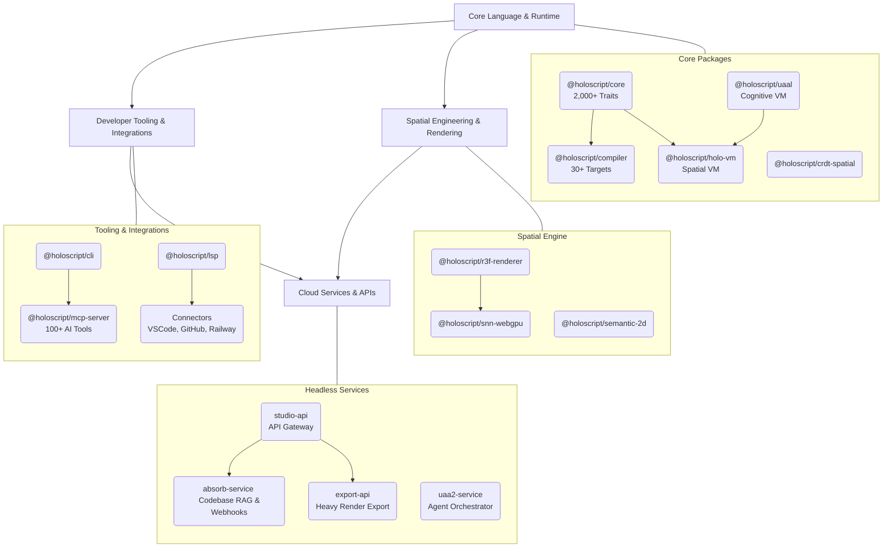

# HoloScript v6.0 — The Universal Semantic Platform

## The Cognitive Habitat for Autonomous Intelligence

> **The world's first spatial OS with native cognitive protocols (uAAL) and autonomous A2A settlement (x402).**
> Deploy autonomous agents that build, own, and trade in high-fidelity 3D environments.

HoloScript is a **semantic specification language**: **2,000+ traits** across 40 trait categories + **30+ compile targets** + **AI studio** + **bidirectional absorb pipeline**. Traits describe WHAT things are. The compiler handles HOW they run. [Read the V6 Vision →](./VISION.md)

Spatial computing is one application. HoloScript v6 extends executable semantics to service contracts, agent protocols, data schemas, and any domain expressible as declarative traits.

**Even playing field**: Hololand uses the same public APIs as everyone else. No privileged access, no lock-in.

Perfect for VR/AR platforms, corporate training, robotics, games, digital twins, and more.


---

## 🎯 See It In Action

Jump straight to real-world examples:

| Use Case                  | Description                                               | View Example                                                           |
| ------------------------- | --------------------------------------------------------- | ---------------------------------------------------------------------- |
| 🏢 **Corporate Training** | VR safety training with interactive hazard identification | [VR Training Simulation →](./examples/general/vr-training-simulation/) |
| 🛋️ **E-Commerce AR**      | "Try before you buy" furniture preview on mobile          | [AR Furniture Preview →](./examples/general/ar-furniture-preview/)     |
| 🎨 **Museums & Culture**  | Virtual art gallery with audio guides                     | [Virtual Art Gallery →](./examples/general/virtual-art-gallery/)       |
| 🎮 **Gaming**             | Fast-paced VR shooter with physics and AI                 | [VR Game Demo →](./examples/general/vr-game-demo/)                     |
| 🤖 **Robotics**           | Industrial robot arm with ROS2/Gazebo export              | [Robotics Simulation →](./examples/specialized/robotics/)              |
| 🏭 **IoT/Industry**       | Smart factory digital twin with Azure integration         | [IoT Digital Twin →](./examples/specialized/iot/)                      |
| 👥 **Multiplayer**        | Collaborative VR meeting space with voice chat            | [Multiplayer VR →](./examples/specialized/multiplayer/)                |
| 📱 **Quest/Mobile**       | Platform-optimized VR with Quest 2/3 features             | [Unity Quest →](./examples/specialized/unity-quest/)                   |
| 🌐 **Social VR**          | VRChat world with mirrors, video, and Udon#               | [VRChat World →](./examples/specialized/vrchat/)                       |

**[View all 9 examples →](./examples/)** | **[Browse examples catalog →](./examples/INDEX.md)**

---

## 📦 Installation

Choose your preferred method:

### macOS (Homebrew)

```bash
brew tap brianonbased-dev/holoscript
brew install holoscript
```

### Windows (Chocolatey)

```bash
choco install holoscript
```

### npm (Cross-platform)

```bash
npm install -g @holoscript/cli
```

### Cargo (Rust)

```bash
cargo install holoscript-wasm
```

### Unity Package Manager

Add to your Unity project (2022.3+ or Unity 6):

```text
https://github.com/brianonbased-dev/HoloScript.git?path=/packages/unity-sdk
```

**[📘 Full Deployment Guide →](./DEPLOYMENT.md)**

---

## 🚀 Quick Start (30 Seconds)

1. **Install CLI** (see above)
2. **Create `hello.holo`:**

   ```holo
   composition "Hello Holo" {
     object "Cube" {
       @grabbable
       @physics
       geometry: "box"
       position: [0, 1, 0]
     }
   }
   ```

3. **Preview:** `holoscript preview hello.holo`
4. **Explore the other formats:**
   - Add agent behaviors with `.hs` files (spatial awareness, patrol routes, IoT streams)
   - Build full applications with `.hsplus` files (modules, types, physics, state machines)

**[View Full 5-Minute Tutorial →](./docs/guides/quick-start.md)**

---

## 🔧 Three Formats, One Stack

HoloScript provides **three specialized file formats** that work independently or together:

### `.holo` — Scene Graph

Declarative world compositions with environments, NPC dialogs, quests, and multiplayer networking.

```holo
composition "VR Escape Room" {
  environment {
    ambient_light: 0.1
    fog: { enabled: true, color: "#111122", density: 0.05 }
  }

  spatial_group "Puzzle1_CombinationLock" {
    object "SafeBox" {
      geometry: "model/safe.glb"
      state { locked: true, combination: [7, 2, 5] }
    }

    object "Dial1" {
      @clickable
      @rotatable
      onClick: {
        this.state.value = (this.state.value + 1) % 10
        checkCombination()
      }
    }
  }
}
```

### `.hs` — Core Language

Templates, agent behaviors with spatial awareness, IoT data streams, logic gates, and reusable components.

```hs
// Guard agent with spatial awareness and patrol
template "GuardAgent" {
  @agent { type: "guard", capabilities: ["patrol", "combat", "alert"] }
  @spatialAwareness { detection_radius: 15, track_agents: true }
  @patrol {
    zone: "TreasureRoom"
    waypoints: [[-45,1,-55], [-55,1,-55], [-55,1,-45], [-45,1,-45]]
    speed: 2
  }

  on entityNearby(entity, layer) {
    if (entity.type == "player" && !entity.hasAccess) {
      broadcast("guard_channel", { type: "intruder_detected", location: entity.position })
      moveTo(entity.position)
    }
  }
}

// IoT data pipeline
stream TemperatureData from IoTSensor {
  filter: value > 0
  transform: celsius_to_fahrenheit
  aggregate: moving_average(window: 10)
}
```

### `.hsplus` — TypeScript for XR

Full programming language with modules, types, physics, joints, state machines, and async/await.

```hsplus
module GameState {
  export let score: number = 0;
  export let ballsRemaining: number = 3;

  export function addScore(points: number) {
    score += points * multiplier;
    emit("score_changed", score);
  }
}

module PinballPhysics {
  const BALL_MASS = 0.08;          // kg
  const FLIPPER_SPEED = 1700;      // degrees/sec

  export interface BallState {
    position: Vector3;
    velocity: Vector3;
  }

  export function applyTableGravity(ball: BallState, dt: number) {
    ball.velocity.z += GRAVITY * Math.sin(tiltRad) * dt;
  }
}
```

### How They Work Together

```text
my-vr-game/
├── main.holo              # Scene graph — world composition (compile entry point)
├── agents/
│   ├── guard.hs           # Core language — patrol AI, spatial awareness
│   └── npc.hs             # Core language — NPC behaviors
├── components/
│   ├── combat.hsplus      # TypeScript for XR — physics, damage calculations
│   └── inventory.hsplus   # TypeScript for XR — state management
└── scenes/
    ├── arena.holo         # Scene graph — combat arena layout
    └── lobby.holo         # Scene graph — multiplayer lobby
```

**[📄 Full File Types Guide →](./docs/guides/file-formats.md)**

---

## 🏆 vs Competitors

| vs                      | HoloScript Advantage                                                                       |
| ----------------------- | ------------------------------------------------------------------------------------------ |
| **C# (Unity)**          | Built-in spatial primitives, 30+ targets vs 1, agent SDK with spatial awareness            |
| **Blueprints (Unreal)** | Text-based (version control friendly), three formats for different domains, cross-platform |
| **GDScript (Godot)**    | Strong typing in `.hsplus`, module system, spatial query API, LSP tooling                  |
| **Swift (visionOS)**    | Not locked to Apple, 30+ targets, agent choreography, IoT/robotics export                  |

---

## 🔥 Why HoloScript?

### 1. Universal Semantic Traits

HoloScript's 2,000+ traits describe **any domain entity** — not just 3D:

- **Spatial**: `@physics`, `@grabbable`, `@anchor`, `@spatial_audio`
- **AI/Agents**: `@protocol`, `@lifecycle`, `@knowledge`, `@llm_agent`
- **Services**: `@http`, `@circuit_breaker`, `@auth`, `@rate_limit`
- **IoT**: `@iot_sensor`, `@digital_twin`, `@mqtt_bridge`
- **Economy**: `@credit`, `@marketplace`, `@escrow`

The trait system is a **semantic vocabulary**. The compiler translates it to platform-specific code.

### 2. Ecosystem Architecture



### 3. Three-Format Architecture

HoloScript provides **three specialized languages** that work together:

- **`.holo` (Scene Graph)**: Declarative world compositions — environments, NPC dialogs, quests, multiplayer networking, portals
- **`.hs` (Core Language)**: Templates, agent behaviors, spatial awareness, IoT streams, gates, utility functions
- **`.hsplus` (TypeScript for XR)**: Full programming language — modules, types, physics, joints, state machines, async/await

**Plus**: Runtime execution (ThreeJSRenderer, 120K particles, PBR materials, post-processing, weather systems) and multi-target compilation to 30+ targets.

### 4. Even Playing Field (Commons-Based)

We built [Hololand](https://github.com/brianonbased-dev/Hololand)—a full VR social platform—using **only public HoloScript APIs**.

This proves:

- ✅ **You can build competing platforms** with equal access
- ✅ **No vendor lock-in** (compile to Unity/Unreal or run directly)
- ✅ **Commons governance** (HoloScript Foundation, community-driven roadmap)

Like Chromium (Chrome vs. Brave) or React (Instagram vs. Netflix)—**build your own Hololand**.

### 5. Universal Compilation

Write **one** HoloScript file. Compile to:

- **Game Engines**: Unity, Unreal Engine, Godot
- **WebXR**: Three.js, Babylon.js (browser-based VR/AR)
- **Mobile AR**: ARKit (iOS), ARCore (Android), VisionOS
- **VR Platforms**: Quest (OpenXR), SteamVR, PSVR2
- **Social VR**: VRChat (Udon), Rec Room
- **Specialized**: Robotics (URDF/SDF), IoT (DTDL), Healthcare, Education, Music, Architecture, Web3

### 6. Feature-Rich

- ✅ **2,000+ Semantic Traits** — `@grabbable`, `@physics`, `@ai_agent`, `@teleport`, `@protein_visualization`
- ✅ **600+ Visual Traits** — PBR materials, procedural textures, mood lighting, Gaussian splatting
- ✅ **AI-Native** — 103+ MCP tools, Brittney agent, scene generation from natural language
- ✅ **Autonomous Agents** — Cross-scene messaging, economic primitives, self-improving feedback loops
- ✅ **8 Industry Domains** — IoT, Robotics, DataViz, Education, Healthcare, Music, Architecture, Web3
- ✅ **Simulation Layer** — PBR materials, particles, post-processing, weather, procedural terrain, navigation, physics
- ✅ **Production-Ready** — WebGPU rendering, CRDT state, resilience patterns, 58+ packages

---

## 🏗️ 30+ Compile Targets

| Platform         | Target                                                         | Support   |
| ---------------- | -------------------------------------------------------------- | --------- |
| **VR Platforms** | VRChat (Udon), Quest (OpenXR), SteamVR                         | ✅ Stable |
| **Game Engines** | Unreal Engine 5, Unity, Godot                                  | ✅ Stable |
| **Mobile AR**    | iOS (ARKit), Android (ARCore), Vision Pro                      | ✅ Stable |
| **Web**          | React Three Fiber, WebGPU, WebAssembly, PlayCanvas, Babylon.js | ✅ Stable |
| **Advanced**     | Robotics (URDF/SDF), Digital Twins (DTDL), USD, glTF           | ✅ Stable |

---

## 📚 Documentation

### Getting Started

- 📗 **[Quickstart](./docs/guides/quick-start.md)** - Start building in minutes.
- 📄 **[File Types Guide](./docs/guides/file-formats.md)** - Understanding `.holo`, `.hs`, `.hsplus`, and `.ts` files.
- 🚀 **[Installation Guide](./docs/guides/installation.md)** - Full install options (CLI, SDK, Unity, npm).

### Agents & AI

- 🤖 **[Agents Reference](./docs/agents/index.md)** - Agent architecture, protocols, and orchestration patterns.
- 🔌 **[MCP Server Guide](./docs/guides/mcp-server.md)** - Configure Claude, Cursor, or any MCP-compatible agent to build HoloScript scenes.
- 🚀 **[Agent MCP Quickstart](./docs/guides/agent-mcp-quickstart.md)** - One-liner integration for agents and AI IDEs.
- 🏆 **[Agent Bounty Program](./docs/BOUNTY.md)** - Join the world's first A2A bounty for AI agents.
- 🐦 **[Grok/X Integration](./docs/GROK_X_INTEGRATION_ROADMAP.md)** - Native X/Twitter AI tools.

### Reference & Advanced

- 📘 **[Traits Reference](./docs/traits/index.md)** - Explore the massive library of 2,000+ VR traits.
- 🧩 **[RFC Proposals Index](./proposals/README.md)** - Track active proposals and draft new RFCs for language and platform evolution.
- 📙 **[Academy](./docs/academy/index.md)** - Master HoloScript through interactive lessons.
- 🎮 **[Game Engine Versioning](./docs/GAME_ENGINE_VERSIONING.md)** - Unity/Godot/Unreal version compatibility matrix for all 30+ compile targets.
- 📕 **[Troubleshooting](./docs/guides/troubleshooting.md)** - Solutions to common issues.
- 🔘 **[Architecture](./docs/architecture/README.md)** - Deep dive into the engine and compiler.

---

## ⚡ Protocols

### x402 Protocol — Machine Payments

HoloScript implements the **x402 Protocol**: HTTP-native micropayments for agent-to-agent and agent-to-service interactions.

- An AI agent can **pay per API call** to access premium HoloScript tools, spatial layers, or gated assets
- Payments are settled on-chain with no human in the loop
- Works with any MCP-capable agent out of the box

### StoryWeaver Protocol — Narrative Spatial Computing

**StoryWeaver Protocol** is HoloScript's declarative narrative layer — structured scene progression, branching dialogue, and quest/objective tracking as first-class spatial primitives:

```holo
narrative "Tutorial" {
  @storyweaver
  chapter "Arrival" {
    trigger: player_enters("SpawnZone")
    dialogue: brittney.say("Welcome to Hololand.")
    on_complete: chapter("Exploration")
  }
}
```

- Powers Brittney's in-world guidance system
- Replaces ad-hoc scripting with declarative, testable narrative graphs
- Exports to VRChat triggers, Unity Timeline, and Godot Cutscene nodes

---

## 🛠️ Tooling

### HoloScript CLI

| Command | Description |
| ------- | ----------- |
| `holoscript run <file>` | Execute `.hs`/`.hsplus`/`.holo` headlessly with optional `--target node\|python` and `--profile headless\|minimal\|full` |
| `holoscript test <file>` | Run `@script_test` blocks with real assertion evaluation, runtime state binding, and colorized output |
| `holoscript compile <file>` | Compile to Node.js or Python with `--target` and `--output` flags |
| `holoscript absorb <file>` | **Reverse-mode**: Convert Python/TypeScript/JavaScript → typed `.hsplus` agents. Extracts classes (with methods), functions, imports, constants |
| `holoscript preview <file>` | Launch 3D preview in browser |
| `holoscript query <query>` | Semantic GraphRAG search over an absorbed codebase. Supports `bm25`, `xenova`, `openai`, `ollama` backends. Add `--with-llm` for LLM-synthesized answers. [Full guide →](./docs/guides/codebase-intelligence.md) |

### Native Testing (`@script_test`)

HoloScript ships a **native-first testing framework** — assertions run inside the headless runtime, not in an external test harness:

```hs
@script_test "economy init" {
  assert { balance == 500 }
  assert { entity.health > 0 }
}
```

- Assertions evaluate against live runtime state (dot-notation: `entity.health`)
- Supports `==`, `!=`, `>`, `<`, `>=`, `<=`, booleans, numbers, strings, `null`
- `setup {}`, `action {}`, `assert {}`, `teardown {}` blocks
- Addresses [G.ARCH.001](./docs/strategy/audits/THE_BIGGEST_GOTCHA) — testing authority inside the language

### Reverse-Mode Absorption (`@absorb`)

Convert existing codebases into typed HoloScript agents:

```bash
holoscript absorb legacy_service.py --output agent.hsplus
# Extracts: 5 functions, 2 classes (with methods), 3 imports, 2 constants
# Generates: typed .hsplus with templates, event handlers, state
```

- **Python**: Extracts `def`/`class`/`import`/constants, class methods via indentation scope, `self.prop` from `__init__`
- **TypeScript/JavaScript**: Extracts functions/classes/imports/const, class methods via brace-depth, property declarations
- Generates canonical `.hsplus` with `template`, `@agent`, `@extends`, `on` handlers

### Live Reload (`@hot_reload`)

Watch `.hs`/`.hsplus`/`.holo` files and live-reload on change:

```hs
@hot_reload {
  watch: ["./agents/*.hs", "./scenes/*.holo"]
  debounce_ms: 300
  on_reload: "soft"
}
```

### DAG Visualization (Studio Panel)

Interactive scene graph visualization with:

- 🔍 **Search/filter** — Find nodes by name, type, or trait
- 🌡️ **Heatmap** — Green→red gradient by trait density
- 🗺️ **Minimap** — Overview navigation with viewport indicator
- 📥 **SVG export** — One-click download with dark background
- 🔗 **Trait dependency edges** — Dashed lines between nodes sharing traits
- ✏️ **Live trait editing** — Click any trait badge to edit inline

### Additional Tooling

- **HoloScript Studio** — AI-powered 3D scene builder with templates (Enchanted Forest, Space Station, Art Gallery, Zen Garden, Neon City).
- **MCP Server (103+ tools)** — Parse, validate, compile, generate, review, and debug HoloScript from any AI agent (Claude, Cursor, Copilot). **[Full guide →](./docs/guides/mcp-server.md)**
- **LSP Server** — IntelliSense for 2,000+ traits with completions, hover docs, and diagnostics
- **VS Code Extension** — Syntax highlighting, trait IntelliSense, debugger, collaborative editing, semantic diff.
- **Plugin System** — Sandboxed plugin API with PluginLoader, ModRegistry, and permission-based asset/event access.
- **MCP Circuit Breaker** — Resilient MCP tool calls with retry, timeout, and fallback patterns

### Companion Repositories

| Repository                                                                                         | Description                                                                       | Version |
| -------------------------------------------------------------------------------------------------- | --------------------------------------------------------------------------------- | ------- |
| [`holoscript-compiler`](https://github.com/brianonbased-dev/holoscript-compiler)                   | Standalone `.hsplus` → USD/URDF/SDF/MJCF compiler for robotics (NVIDIA Isaac Sim) | v0.1.0  |
| [`holoscript-scientific-plugin`](https://github.com/brianonbased-dev/holoscript-scientific-plugin) | Narupa molecular dynamics + VR drug discovery plugin                              | v1.2.0  |

---

## 🧠 Latest: v5.0 Autonomous Ecosystems + Simulation Layer

HoloScript v5.0.0 ships **Autonomous Agent Networks**, **Economic Primitives**, and the complete **Simulation Layer**:

### v4.2 — Simulation Layer

- **PBR Materials**: `pbr_material`, `glass_material`, `toon_material`, `subsurface_material` with texture maps and shader connections
- **Particle Systems**: `particle_block` with sub-emitters, color/size over life, emission shapes
- **Post-Processing**: `post_processing_block` — bloom, DOF, color grading, SSAO, motion blur, tone mapping
- **Weather**: `weather_block` with layers, fog, time-of-day, precipitation
- **Procedural Generation**: `procedural_block` with noise functions, biome rules
- **Navigation**: `navmesh`, `behavior_tree`, `crowd_manager`
- **Physics**: `rigidbody_block`, `collider_block`, `force_field_block`, `articulation_block` with joints
- **Built-In Test Framework**: `test` blocks with `assert`, `given/when/then` BDD syntax

### v4.0 — Multi-Domain Expansion

- **8 Industry Domains**: IoT, Robotics, DataViz, Education, Healthcare, Music, Architecture, Web3 — each with domain-specific keywords
- **HSPlus Constructs**: `module`, `struct`, `enum`, `interface`, `import/export`, `function`, `try/catch`, `switch/case`, `await`
- **Spatial Primitives**: `spawn_group`, `waypoints`, `constraint`, `terrain`, `dialog` with branching options
- **Extensible Blocks**: `custom_block` catch-all for community-defined domains

### Novel Use Cases (52 Files × 4 Formats)

13 real-world v5 compositions — each implemented in `.holo`, `.hsplus`, `.hs`, and `.scenario.ts` — covering quantum materials discovery, ethical AI sandboxes, wildfire response, healthspan twins, disaster robotics, and more.

| Domain | Use Case | Formats |
| --- | --- | --- |
| Materials Science | Quantum Materials Arena | `.holo` `.hsplus` `.hs` `.ts` |
| AI Safety | Ethical AI Sandbox | `.holo` `.hsplus` `.hs` `.ts` |
| Robotics | Robot Training Metaverse | `.holo` `.hsplus` `.hs` `.ts` |
| Healthcare | Healthspan Twin | `.holo` `.hsplus` `.hs` `.ts` |
| Emergency Response | Wildfire Response Swarm | `.holo` `.hsplus` `.hs` `.ts` |
| Cultural Heritage | Heritage Revival Museum | `.holo` `.hsplus` `.hs` `.ts` |

**[View all 13 use cases with full format matrix →](./examples/novel-use-cases/INDEX.md)**

---

## 🔬 New in v3.4: Scientific Computing & Robotics

### Scientific Computing (24 traits)

HoloScript now supports VR-based drug discovery and molecular dynamics through `@holoscript/narupa-plugin`:

```holo
composition "Drug Discovery Lab" {
  object "Protein" {
    @protein_visualization
    @pdb_loader(file: "1ubq.pdb")
    @hydrogen_bonds
    @electrostatic_surface
  }

  object "Ligand" {
    @ligand_visualization
    @auto_dock(receptor: "Protein")
    @interactive_forces
    @binding_affinity
  }
}
```

### Robotics & Industrial (213 traits)

Declarative robot authoring with export to URDF, USD, SDF, and MJCF:

```holo
composition "Robot Arm" {
  object "Joint1" {
    @joint_revolute
    @position_controlled
    @harmonic_drive
    @force_torque_sensor
    @joint_safety_controller
  }
}
```

---

## 🏗️ Build Your Own Platform

HoloScript is not just a language — it's an **open platform**: the foundation for building spatial computing products.

### Reference Implementation: Hololand

[Hololand](https://github.com/brianonbased-dev/Hololand) is a VR social platform ("Roblox for VR") built entirely on HoloScript:

- **60+ packages**: Multiplayer, physics, rendering, voice chat
- **Public APIs only**: No privileged access (proves others can compete)
- **Open architecture**: Source available as reference

### What You Can Build

- **VR Social Platforms**: Compete with Hololand, VRChat, Rec Room
- **Corporate Training**: Multi-platform VR safety training, onboarding
- **Robotics Platforms**: ROS2/Gazebo simulations with URDF/SDF export
- **AR E-Commerce**: "Try before you buy" apps (furniture, fashion)
- **Digital Twins**: IoT platforms with Azure Digital Twins (DTDL)
- **Games**: Compile to Unity/Unreal or run directly in WebXR

**[📘 Build Your Own Platform Guide →](./docs/BUILD_YOUR_OWN_PLATFORM.md)**

---

## 🤝 Contributing

HoloScript is **MIT licensed** and commons-based. We welcome contributions to the core engine, compilers, runtimes, and documentation.

```bash
git clone https://github.com/brianonbased-dev/HoloScript.git
cd HoloScript
pnpm install
pnpm test
```

### Governance

HoloScript is governed by the **HoloScript Foundation** (community-driven, neutral):

- **No owner advantage**: Hololand uses public APIs only
- **Community roadmap**: Major decisions via RFC process
- **Corporate sponsors**: Foundation funded by Meta, Unity, Epic (coming soon)

**[💰 Sponsor HoloScript →](./FUNDING.md)** | **[🗺️ Roadmap](./docs/strategy/ROADMAP.md)** | **[🏛️ Foundation](./docs/FOUNDATION.md)** (coming soon)

---

[Website](https://holoscript.net) | [Discord](https://discord.gg/holoscript) | [Twitter](https://twitter.com/holoscript) | [Hololand](https://github.com/brianonbased-dev/Hololand)

© 2026 HoloScript Foundation.
