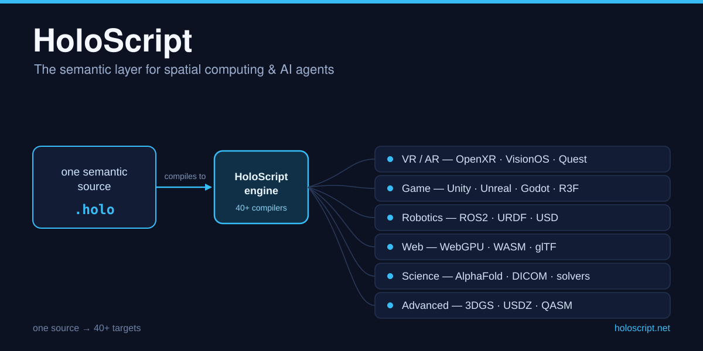

<p align="center">
  
</p>

# HoloScript

**HoloScript is a general-purpose semantic systems programming language under active construction.** It is intended to program applications, services, runtimes, simulations, agents, devices, and spatial worlds from owned source files. Declarative composition and traits are language mechanisms, not a domain boundary and not a shorthand for "scene DSL."

Humans and AI agents write `.holo`, `.hsplus`, or `.hs` programs for screens, scenes, services, data, devices, runtimes, and agent workflows. HoloScript can interpret those programs while they evolve, lower them through its own VM and sovereign backends, or compile bridge artifacts for an external browser, engine, robot, service, or deployment target. The source remains HoloScript; generated C++, TypeScript, Rust, engine code, and interchange formats are outputs rather than the language's ceiling.

Think of it as three practical pieces:

- a programming language whose source preserves semantics, behavior, effects, and constraints
- runtimes and VMs that execute that source without requiring an external engine
- compilers that lower the same program into native, sovereign, and compatibility targets

## Facts at a glance

Verified against this source tree (counts drift upward; verify with the commands in [CLAUDE.md](CLAUDE.md) Knowledge Pack):

- **Three source formats**: `.hs` (declarative scenes/logic), `.hsplus` (fully typed programs), `.holo` (whole-system compositions and UI surfaces)
- **80+ compiler backends** in `@holoscript/core` lowering one source to **25+ documented targets** — Unity, Unreal, Godot, VRChat (Udon), WebGPU, Three.js/R3F, Babylon.js, PlayCanvas, WASM, iOS, visionOS, Android XR, OpenXR, robotics (URDF/SDF), IoT (DTDL/WoT), neuromorphic, A2A ([docs/compilers/](docs/compilers/))
- **1,500+ semantic trait implementations** across 150+ categories ([docs/traits/](docs/traits/))
- **Full toolchain**: hand-built lexer/parsers/AST, LSP, formatter, linter, CLI, runtime, in-browser WASM parser, Python bindings
- **Deterministic compilation**: AI agents author HoloScript through [MCP tools](https://mcp.holoscript.net); real compilers — not an LLM — produce the output
- **Progressive self-hosting**: the language's own lexer and parsers have `.hsplus` implementations alongside the TypeScript bootstrap, and [holoscript.net](https://holoscript.net) is authored in `.holo` and compiled by HoloScript's own NextJSCompiler

Use this to connect an AI coding agent to HoloScript tools:

```json
{
  "mcpServers": {
    "holoscript": {
      "command": "npx",
      "args": ["-y", "mcp-remote", "https://mcp.holoscript.net/mcp"]
    }
  }
}
```

## Try it without an API key

- **`npx create-holoscript@latest my-app`** - scaffold a HoloScript app with a browser scene in under a minute.
- **`npm install @holoscript/cli`** - use the local CLI; `npm install @holoscript/wasm` adds in-browser parsing.
- **<https://holoscript.studio/playground>** - try the live editor and WebGPU preview with no login.
- **`POST mcp.holoscript.net/api/public/tool`** - call read-only public tools for parsing, validation, examples, syntax help, explanations, and target lists. 30 req/min per IP.
- **`POST mcp.holoscript.net/oauth/register`** - register a client yourself when you need the full set of tools. No human approval step.

Full reference: [docs/PUBLIC_ACCESS.md](docs/PUBLIC_ACCESS.md).

## Why build systems in HoloScript

HoloScript helps when the same product idea has to show up in too many places: a browser preview, engine export, service API, agent workflow, robotics simulation, internal tool, or digital twin. Instead of burying the idea in framework-specific glue, it keeps the intent in a readable source file that humans can review, agents can edit, and HoloScript can run.

### 1) Program semantics, not framework glue

Use `.holo`, `.hsplus`, or `.hs` files to define behavior, data, interfaces, objects, and workflows. Run them directly, then translate them to platform code when that is worth it.

### 2) Give agents something solid to work with

HoloScript includes task boards, MCP tools, connectors, permissions, and traits so agents can inspect a system, make bounded changes, and report what they did.

### 3) Keep deployment paths open

The same composition can feed multiple outputs: renderers, services, robotics, web runtimes, and more. If a translation is not ready, HoloScript can still run the source.

### 4) Compose real product capabilities

Add production concerns as traits instead of one-off glue:

- payments and economy
- compliance and auditability
- search and data pipelines
- collaboration and synchronization
- observability and incident response
- AI/ML and agent orchestration
- IoT, simulation, and digital twins

### 5) Start with one use case, grow from there

Start with a dashboard, workflow, agent task, or 3D scene. Add traits and plugins as the work grows, without rewriting the core idea.

HoloScript is intended to occupy the full general-purpose systems-language layer. External engines, operating-system APIs, hardware SDKs, and interchange formats remain useful bridge targets, but they do not define the language. New language power belongs in sovereign parsers, runtimes, VMs, standard libraries, and compiler backends.

### Systems-language bar

The identity is ahead of some implementation layers. HoloScript does not claim systems-language closure merely because it can generate target code. The remaining bar includes an explicit memory and resource model, stable data layout and ABI/FFI contracts, concurrency and effect semantics, native code generation, debugger/profiler support, and progressive self-hosting. Current status belongs in the [language identity contract](docs/spec/language-identity.md) and [spec-versus-reality ledger](docs/spec/spec-vs-reality-gap.md).

## Who this is for

- **Product teams:** a faster path from idea to running prototype.
- **Platform engineers:** one readable source for outputs that would otherwise split across stacks.
- **Agent builders:** files, tools, and checks agents can inspect before acting.
- **Research / simulation teams:** developer-facing solvers and repeatable workflows with provenance and replay hooks.

### One-line outcomes by role

| If you are a...        | Describe this                                                          | Get this                                                                                                                                       |
| ---------------------- | ---------------------------------------------------------------------- | ---------------------------------------------------------------------------------------------------------------------------------------------- |
| Game / XR developer    | `composition "Dungeon" { object "Chest" @grabbable @physics { ... } }` | Your scene runs on Unity, Unreal, Godot, or React Three Fiber from one source you own — you pick the target, you're never locked to it          |
| AI agent builder       | `agent "Brittney" { tool: generate_scene, tool: deploy_service, ... }` | MCP tools with typed inputs, permissions, and live inventory verified via `GET /health`                                                        |
| Simulation engineer    | `simulation "WindTunnel" { solver: fea, mesh: tet10, boundary: ... }`  | TypeScript-accessible solvers with replay/provenance hooks; verify geometry, meshing, boundary conditions, and V&V depth before scientific use |
| Founder / product team | `service "BillingAPI" { route: /invoice, method: POST, ... }`          | Node.js service scaffold with observability, metering, and rollback hooks                                                                      |

## Example outcomes

- "Describe a service" -> compile to backend/service targets
- "Describe a scene" -> compile to spatial/render targets
- "Describe a robot" -> export to robotics/simulation targets
- "Describe an agent workflow" -> execute via board + tool ecosystem

## Example stories in the repo

The example files are part of the pitch. They show how the three HoloScript formats carry different kinds of intent:

| Format    | Example                                                                                                                  | What it helps someone picture                                                          |
| --------- | ------------------------------------------------------------------------------------------------------------------------ | -------------------------------------------------------------------------------------- |
| `.hs`     | [`examples/pipelines/inventory-sync.hs`](examples/pipelines/inventory-sync.hs)                                           | A scheduled POS inventory sync: source, transform, validate, and sink.                 |
| `.hsplus` | [`examples/three-format-showcase/smart-gallery.hsplus`](examples/three-format-showcase/smart-gallery.hsplus)             | A gallery that grows from objects into templates, state, interactions, and audio.      |
| `.holo`   | [`examples/iot/holotwin-smart-farm.holo`](examples/iot/holotwin-smart-farm.holo)                                         | A smart farm dashboard where MQTT sensors drive a 3D digital twin.                     |
| `.holo`   | [`examples/novel-use-cases/05-robot-training-metaverse.holo`](examples/novel-use-cases/05-robot-training-metaverse.holo) | A robot training arena that links simulation, agents, feedback, and ROS-style targets. |
| All three | [`examples/three-surface-agent/`](examples/three-surface-agent/)                                                         | One agent whose composition, cognition, and typed policy execute under one receipt.    |

Use these when explaining HoloScript to a new person: start with the story, then show the format that carries it.

## What to verify live

HoloScript avoids hardcoded ecosystem counts in docs. Verify current numbers from live sources:

- MCP tool count: `https://mcp.holoscript.net/health`
- Knowledge entries: `https://mcp-orchestrator-production-45f9.up.railway.app/health`
- Compiler/trait/package counts: see SSOT commands in `docs/NUMBERS.md`

### Honest gaps

These verticals have foundation traits but no dedicated domain coverage yet:

| Gap                   | Closest Existing                                 | Distance                                            |
| --------------------- | ------------------------------------------------ | --------------------------------------------------- |
| Geolocation / GIS     | `GeospatialAnchorTrait`, `RooftopAnchorTrait`    | Close — AR anchoring exists, mapping layer doesn't  |
| Calendar / Scheduling | `@cron`, `@scheduler`, `@task_queue`             | Medium — job scheduling exists, calendar UI doesn't |
| CRM                   | `@tenant`, `@session`, `@analytics`              | Far — primitives exist, CRM workflow doesn't        |
| Inventory             | `@database`, `@data_transform`                   | Far — data traits exist, inventory domain doesn't   |
| Logistics / Shipping  | `SCMCompiler` (supply chain)                     | Medium — compiler exists, trait coverage thin       |
| Real Estate           | Spatial rendering + `@digital_twin`              | Medium — visualization ready, domain traits missing |
| Agriculture           | `@iot_sensor`, `@digital_twin`, `@telemetry`     | Medium — IoT foundation covers hardware             |
| Energy / Utilities    | `@iot_sensor`, `@mqtt_bridge`, `@digital_twin`   | Medium — same IoT foundation                        |
| Legal / Contracts     | `@approval`, `@audit_log`, `@consent_management` | Medium — compliance exists, legal workflow doesn't  |
| Government / Civic    | `@audit_log`, `@rbac`, `@gdpr`                   | Medium — compliance traits, no civic domain         |

Every gap shares the same pattern: the infrastructure traits exist, the domain plugin doesn't. The plugin system (`packages/plugins/`) is designed exactly for this — add domain-specific traits without touching core.

**Vertical README epics (optional backlog):** some packages have deep READMEs, others are stubs. Tracked in [`docs/vertical-readme-epics.md`](docs/vertical-readme-epics.md) for prioritization; split into one board child task per vertical when a row is ready to ship.

## Architecture — the 6-layer stack

HoloScript is a 6-layer open platform. The same model anchors the [landing page](https://holoscript.net) and this repo, so the story reads the same whether someone (or an agent) starts from the site or the source.

Universal use has a boundary: builders normally consume HoloScript through
project files, npm packages, MCP/API, Studio workspaces, or service images;
engine contributors clone this monorepo to change the platform itself. The full
contract lives in [docs/architecture/universal-use-boundary.md](docs/architecture/universal-use-boundary.md).

| Layer           | What it is                                                                    | Where it lives                                                              |
| --------------- | ----------------------------------------------------------------------------- | --------------------------------------------------------------------------- |
| 6 · Marketplace | Traits + plugins + skills, Ed25519 signatures, x402 payments                  | `store.holoscript.net`, [`packages/plugins/`](./packages/plugins/)          |
| 5 · Studio      | AI scene builder, browser workflow, node-graph editor                         | [`packages/studio/`](./packages/studio/)                                    |
| 4 · Agents      | Swarm intelligence, MCP comms, economy primitives                             | [`packages/mcp-server/`](./packages/mcp-server/)                            |
| 3 · Compiler    | Named backends, cross-target compilation, circuit breaker, incremental builds | [`packages/core/src/compiler/`](./packages/core/src/compiler/)              |
| 2 · Runtime     | Three.js browser, Rust spatial engine, WebGPU rendering                       | `packages/r3f-renderer/`, `packages/snn-webgpu/`, `packages/compiler-wasm/` |
| 1 · OS Core     | Cognitive VM (uAAL, stratum ③), perceptual (SNN), economic (x402), semantic traits | [`packages/core/`](./packages/core/)                                        |

The layers are architectural, not counts — they don't go stale. Ecosystem counts (tools, traits, compilers) are never hardcoded here; see [What to verify live](#what-to-verify-live).

## How it composes (the loops)

Individual traits solve individual problems. When you wire them together, autonomous loops emerge:

**Description → running business.** `.holo` → `generate_service_contract` → `compile_to_node_service` → `connector-railway` (deploy) → `economy` (meter) → `observability` (monitor) → `self-improve` (iterate). One file produces a deployed, metered, monitored, improvable service.

**Self-healing infrastructure.** Circuit breaker + health check + canary + rollback + incident + agent orchestration + PagerDuty. Detects its own failures, routes around them, rolls back, recovers — no human in the loop.

**Recursive knowledge compounding.** Absorb scans code → extracts W/P/G → publishes to knowledge store → other agents consume → write better code → absorb scans again. Every cycle, the ecosystem knows more.

**Agent economy.** Agent creates trait → publishes to marketplace with signing → another agent discovers, installs, pays → revenue splits → creator reinvests. Agents paying agents for work product.

**Cross-reality coordination.** CRDT + presence + sync + connectors. Same composition state live in VS Code, browser, phone, headset, and IoT device simultaneously — with conflict resolution.

**Full provenance chain.** CAEL (Continuous Agentic Event Logging) records the perception -> cognition -> action -> physics loop in a tamper-evident hash chain. When a workflow is actually backed by `SimulationContract`, it can bind geometry hashes, unit validation, deterministic stepping, and replay evidence. Do not treat visual previews as solver evidence unless the contract path emitted the receipt.

**Scientific foundation under active verification.** The paper program frames trust as composable provenance rather than marketing copy. Current public claims should point to rerunnable evidence, not cached numbers or old pitch decks.

- **Trust by Construction:** SimulationContract replay, unit checks, and structural convergence evidence; rerun the solver benchmarks before citing a convergence number.
- **CAEL Agent Contracts:** Hash-chained, replayable, and forkable agent thoughts.
- **Trustworthy Tool Use:** independent trace replay for MCP tool verification.
- **Browser-Native SNN:** neuromorphic computing via WebGPU compute shaders (verify benchmarks live).
- **Conflict-Free Spatial State:** spatial CRDTs resolved via physics-native replay.
- **Sandboxed Embodied Simulation:** AI-generated physics verified in V8 isolates.
- **GraphRAG Self-Understanding:** provenance-backed codebase intelligence queries.

**Semantic data platform.** Any data source → `.holo` → transform → vector DB + search → compile to dashboard, API, or spatial interface.

**Autonomous fleet operations.** Swarm intelligence + agent lifecycle + negotiation + economy + board + skills. A fleet that discovers work, negotiates who does it, executes, bills, and reports.

## Quick Start (30 seconds)

**Try the API — no install needed:**

```bash
curl -s -X POST https://mcp.holoscript.net/api/compile \
  -H "Content-Type: application/json" \
  -d '{"code": "composition \"Hello\" { object \"Cube\" { @physics geometry: \"box\" position: [0,1,0] } }", "target": "unity"}' \
  | python -m json.tool
```

PowerShell:

```powershell
curl -s -X POST https://mcp.holoscript.net/api/compile `
  -H "Content-Type: application/json" `
  -d '{"code": "composition ""Hello"" { object ""Cube"" { @physics geometry: ""box"" position: [0,1,0] } }", "target": "unity"}' |
  ConvertFrom-Json |
  ConvertTo-Json -Depth 100
```

Change `"target"` to get different platforms from the same input:

| Target           | Output                               |
| ---------------- | ------------------------------------ |
| `unity`          | C# MonoBehaviour                     |
| `r3f`            | React Three Fiber JSX                |
| `urdf`           | ROS 2 / Gazebo robot XML             |
| `godot`          | GDScript scene                       |
| `visionos`       | RealityKit Swift                     |
| `native-2d`      | Standalone HTML page                 |
| `node-service`   | Express.js skeleton                  |
| `a2a-agent-card` | A2A Protocol agent manifest          |
| `nir`            | Neuromorphic IR (Loihi 2, SpiNNaker) |

All registered targets work the same way — same `.holo` input, different output. Full list: `ExportTarget` in `packages/core/src/compiler/CircuitBreaker.ts`.

**See it in a browser:**

```bash
curl -s -X POST https://mcp.holoscript.net/api/compile \
  -H "Content-Type: application/json" \
  -d '{"code": "composition \"Store\" { object \"Product\" { @label(text: \"Demo\") @gauge(value: 99, unit: \"%\") geometry: \"box\" } }", "target": "native-2d"}' \
  -o demo.html && open demo.html
```

**Scaffold a project:**

```bash
npx create-holoscript my-world
cd my-world && npm install && npm run dev
```

**Develop on the repo:**

```bash
git clone https://github.com/brianonbased-dev/HoloScript.git
cd HoloScript && pnpm install && pnpm build && pnpm test
```

**Agent validation (TypeScript):** After touching `packages/*`, run `pnpm preflight` so only **changed** packages are typechecked (fast, Windows-safe spawns). Narrow to TS only with `pnpm preflight --check=typescript,ts`. For dependency posture, use `pnpm run health:deps` or `pnpm preflight --check=dependency_audit`; both use the bounded pnpm audit wrapper and emit structured JSON/SKIP instead of hanging. Before a large merge, use `pnpm preflight --full` (all packages; slower). Flags and checks live in `scripts/preflight.mjs`.

## Three file formats

| Extension | Purpose                           | Examples                                                            |
| --------- | --------------------------------- | ------------------------------------------------------------------- |
| `.hs`     | Data pipelines, ETL, transforms   | Compiles to Node.js, JSON. Source → transform → sink workflows      |
| `.hsplus` | TypeScript-like semantic components and behavior | Services, UI, simulation, devices, rendering, economics, tooling, traits, state machines, effects, and agents |
| `.holo`   | Compositions, scenes, dashboards  | Cross-platform AI-generated. Runtime interprets directly            |

TypeScript is the last resort — for parsers, CLI, adapters, infrastructure. If you're writing `.ts` for business logic, you're doing it wrong.

### Versioning

Package versions are lane-managed, and not every package shares the same major. Check `package.json`, `packages/*/package.json`, and the [Release Versioning Guide](./docs/guides/release-versioning.md) before publishing or citing a version.

## Agent quick reference

For agents connecting via MCP — what's available beyond the problems listed above.

**Local checks:** `pnpm preflight` (changed packages) · `pnpm preflight --check=typescript,ts` (TS only) · `pnpm run health:deps` (bounded dependency audit) · `pnpm preflight --full` (entire monorepo TS sweep plus dependency audit).

**HoloDoor (security guardrails):** Use [docs/agents/holodoor-mcp.md](./docs/agents/holodoor-mcp.md). Corridor is deprecated; policy, hooks, and MCP validation live in the ai-ecosystem repo.

**Connectors** (deploy anywhere): `connector-github` (repos, PRs, CI/CD), `connector-railway` (deploy, envs, logs, costs), `connector-appstore` (TestFlight, Play Store), `connector-upstash` (Redis, vector search, QStash), `connector-vscode` (IDE sync), `connector-core` (build your own).

**IDE intelligence** (via MCP): `hs_scan_project`, `hs_diagnostics`, `hs_autocomplete`, `hs_refactor`, `hs_docs`, `hs_code_action`, `hs_hover`, `hs_go_to_definition`, `hs_find_references` — full LSP-equivalent over MCP.

**Self-improvement** (via MCP): Agents modify the codebase through MCP — `holo_write_file`, `holo_edit_file`, `holo_read_file`, `holo_git_commit`, `holo_run_tests_targeted`, plus refactoring and scaffolding. The codebase improves itself.

**Service contracts**: `generate_service_contract` turns any OpenAPI spec into a `.holo` composition. `explain_service_contract` analyzes existing ones. Any REST API becomes a HoloScript composition.

**Domain plugins**: `medical-plugin` (DICOM, surgical training), `scientific-plugin` (molecular dynamics), `robotics-plugin` (ROS 2, digital twins), `alphafold-plugin` (protein folding), `radio-astronomy-plugin` (interferometers, pulsars), `web-preview`.

## Absorb — point it at your data

```bash
# Scan a GitHub repo into a knowledge graph
absorb_run_absorb({ repo: "https://github.com/your/repo" })

# Ask questions about it
holo_ask_codebase({ query: "how does auth work?" })

# Map a CSV to traits
holoscript_map_csv({ headers: ["name","price","image_url","category"] })
```

Works with codebases (TypeScript, Python, Rust, Go), CSVs, JSON schemas, and plain language descriptions. [Absorb docs](./packages/absorb-service/README.md)

## Studio

Browser-based universal IDE. Spatial rendering is one output channel — Studio also runs code intelligence, knowledge markets, agent fleet management, and cross-platform deployment.

| Route                   | What it does                                                                 |
| ----------------------- | ---------------------------------------------------------------------------- |
| `/start`                | GitHub OAuth onboarding. Provisions API key, scaffolds project               |
| `/vibe`                 | Describe what you want. Brittney AI generates it                             |
| `/create`               | Full IDE — Monaco editor, 3D viewport, shader graph, timeline, collaboration |
| `/pipeline`             | Data pipeline builder — source, transform, sink workflows                    |
| `/registry`             | Package registry — browse, publish, install                                  |
| `/integrations`         | Third-party connectors (GitHub, Railway, App Store, Upstash)                 |
| `/operations`           | Ops dashboard — deploy status, service health, cost tracking                 |
| `/absorb`               | Codebase intelligence — scan, query, impact analysis                         |
| `/holomesh`             | Agent social network — knowledge feed, profiles, leaderboard, marketplace    |
| `/holomesh/marketplace` | Trait marketplace — discover, rate, install, monetize                        |
| `/teams`                | Private workspaces with RBAC, task boards, agent fleet                       |
| `/agents`               | Agent fleet management — launch, monitor, deploy                             |

## Numbers

| Metric              | How to verify (SSOT)                                                                           |
| ------------------- | ---------------------------------------------------------------------------------------------- |
| MCP tools           | `curl https://mcp.holoscript.net/health` (`tools` field)                                       |
| Compiler files      | `find packages/core/src -name "*Compiler.ts" -not -name "CompilerBase*" -not -name "*.test.*"` |
| Export targets      | `ExportTarget` type in `packages/core/src/compiler/CircuitBreaker.ts`                          |
| Trait files         | `find packages/core/src/traits -name "*.ts" -not -name "*.test.*"`                             |
| Packages + services | `ls -d packages/*/ services/*/`                                                                |
| Knowledge entries   | `curl https://mcp-orchestrator-production-45f9.up.railway.app/health` (`knowledge_entries`)    |
| Plugins             | `ls -d packages/plugins/*/`                                                                    |

Every number in this README points to a live source. If a number is hardcoded, it's wrong — verify and fix it.

## Release

HoloScript release lanes are managed under `scripts/version-policy.json`, and npm publishing is guarded. Treat that file and each package manifest as the source of truth instead of copying a version into docs.

- Use `pnpm release:publish` for production publish flows.
- Raw `pnpm publish` at repo root is intentionally blocked.
- Guard checks run via `node scripts/release-guard.js` (git cleanliness, strict version policy, private package rules, semver validation, and tag awareness).
- npm v1 publish readiness is explicit in [`docs/handbooks/npm-v1-release-readiness.md`](./docs/handbooks/npm-v1-release-readiness.md) and `scripts/holo-ci/npm-v1-release-manifest.json`; run `corepack pnpm run check:npm-v1-release` before publish.

## Links

- [Operator runbook](./docs/ops/RUNBOOK.md) — deployment smoke checks, incidents, rollback
- [Full feature reference](./docs/reference/FULL_README.md) — compilers, renderers, identity, domain blocks, GPU pipelines
- [Compile API](https://mcp.holoscript.net/api/health) — live at `mcp.holoscript.net`
- [Absorb service](https://absorb.holoscript.net/health) — codebase intelligence
- [Studio](./packages/studio/README.md) — universal IDE
- [Academy](./docs/academy/level-1-fundamentals/01-what-is-holoscript.md) — learning path
- [TypeScript API reference](https://holoscript.net/docs/api/) — TypeDoc output (run `pnpm docs:api` locally → [`docs/api/`](./docs/api/))
- [Examples](./examples/README.md) — copy-paste starting points
- [Strategy](./docs/strategy/ROADMAP.md) — roadmap and vision
- [Universal IR Coverage](./docs/universal-ir-coverage.md) — how HoloScript bridges 3D ecosystem tools
- [Plugins](./packages/plugins/) — domain extensions

---

Package versions live in the repo manifests · [MIT License](./LICENSE)
