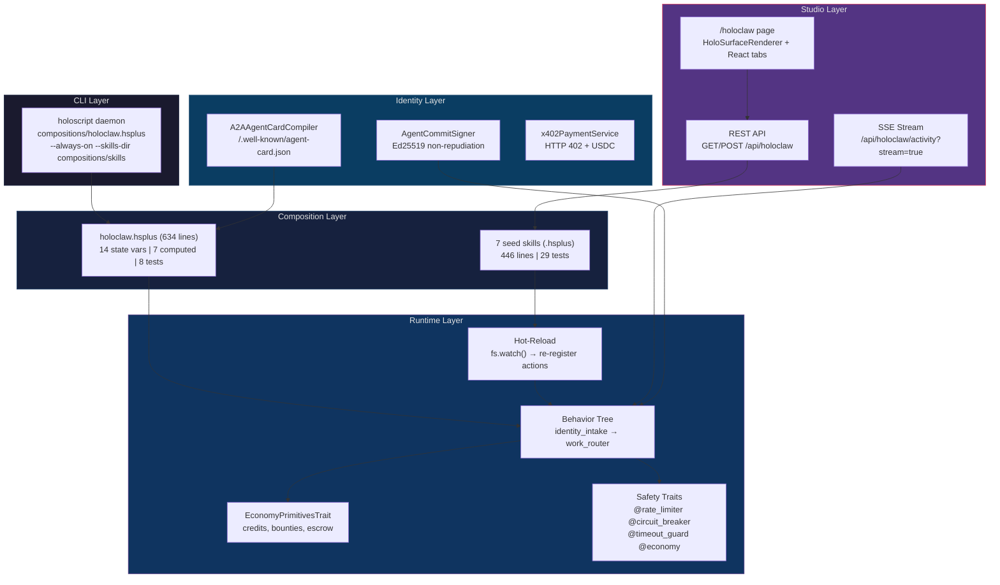

# HoloClaw — Agent Marketplace & Skill System

> **Date**: 2026-03-20 | **Source**: Direct audit of 24+ files, 9,000+ lines | **Version**: 0.1.0

HoloClaw is HoloScript's agent marketplace. Agents install skills (`.hsplus` compositions), run always-on behavior trees, track economy credits, and stream activity via SSE — all in native HoloScript, no external frameworks.

## Architecture



---

## Quick Start

```bash
# Run the HoloClaw agent (always-on mode)
holoscript daemon compositions/holoclaw.hsplus --always-on --debug

# Run a single skill
holoscript daemon compositions/skills/code-health.hsplus

# Test all HoloClaw compositions
holoscript test compositions/holoclaw.hsplus
holoscript test compositions/skills/code-health.hsplus
```

---

## Main Composition: `holoclaw.hsplus`

**634 lines** — state, UI surface, behavior tree, safety traits, event handlers, tests.

### State (14 variables)

| Variable             | Type    | Default      | Purpose                      |
| -------------------- | ------- | ------------ | ---------------------------- |
| `agentName`          | string  | `"HoloClaw"` | Identity                     |
| `agentVersion`       | string  | `"0.1.0"`    | Version                      |
| `agentStatus`        | string  | `"idle"`     | `idle` / `running` / `error` |
| `cycleCount`         | number  | `0`          | Total BT cycles completed    |
| `costUSD`            | number  | `0`          | Cumulative API spend         |
| `tokensBurned`       | number  | `0`          | Total tokens consumed        |
| `budgetRemaining`    | number  | `10`         | Remaining credits            |
| `skillsLoaded`       | number  | `0`          | Installed skill count        |
| `messagesReceived`   | number  | `0`          | Inbound channel messages     |
| `messagesSent`       | number  | `0`          | Outbound channel messages    |
| `healthScore`        | number  | `1.0`        | Repo health (0–1)            |
| `typeErrorCount`     | number  | `0`          | Current tsc errors           |
| `activeTab`          | string  | `"shelf"`    | UI tab state                 |
| `streamingConnected` | boolean | `false`      | SSE connection status        |

### Behavior Tree

```
holoclaw_cycle (sequence, restart_on_complete: true)
├── identity_intake          # Load accumulated wisdom (first tick only)
└── work_router (selector)   # Try 3 paths in priority order
    ├── inbox_path            # channel_ingest → process → channel_send (ack)
    ├── health_path           # shell_exec(tsc --noEmit) → report
    └── heartbeat             # Fallback "alive" ping
```

### Safety Traits

| Trait                | Config                                      | Purpose                   |
| -------------------- | ------------------------------------------- | ------------------------- |
| `@rate_limiter`      | 20 tokens max, refill 5/60s                 | Prevent runaway API calls |
| `@timeout_guard`     | 120s default                                | Kill stuck operations     |
| `@circuit_breaker`   | 5 failures in 5min trips                    | Stop cascading failures   |
| `@economy`           | $10 balance, $2/hr limit, $0.01 task reward | Budget enforcement        |
| `@structured_logger` | 1000 buffer, 200 rotation                   | Audit trail               |

### Event Handlers

| Event                    | Action                                             |
| ------------------------ | -------------------------------------------------- |
| `on_start()`             | Set status to `"running"`, emit `holoclaw:started` |
| `daemon:tool:shell_exec` | Update `lastHealthCheck`                           |
| `daemon:channel:send`    | Increment `messagesSent`, `cycleCount`             |
| `user:message`           | Increment `messagesReceived`                       |
| `daemon:skill_created`   | Increment `skillsLoaded`                           |

### UI Surface (343 lines)

Native dashboard rendered via `HoloSurfaceRenderer` — no React for stats:

- **StatCard template**: Reusable 200x90 panel (title + value)
- **ClawShell**: 1440x860 dashboard with header + 6 stat cards
- Cards: Skills, Messages, Health, Cycles, Budget, Activity

---

## Skills (7 Seed Skills)

All in `compositions/skills/`. Each is a standalone `.hsplus` composition with its own state, BT, economy budget, safety traits, and tests.

| Skill                | Lines | Budget | What It Does                                                           |
| -------------------- | ----- | ------ | ---------------------------------------------------------------------- |
| **code-health**      | 61    | $0.10  | `tsc --noEmit` + lint scan + vitest → health score                     |
| **lint-sweep**       | 103   | $0.50  | Find console.log / @ts-ignore / `as any` → auto-fix via `generate_fix` |
| **test-runner**      | 56    | $0.05  | Targeted vitest for specific packages                                  |
| **dependency-audit** | 56    | $0.05  | `npm audit` + `ncu --jsonUpgraded` → CVE + outdated report             |
| **dead-code-finder** | 51    | $0.10  | `ts-prune` → unused export detection                                   |
| **git-digest**       | 59    | $0.02  | `git log --since=24h` → commit summary for standups                    |
| **bundle-analyzer**  | 60    | $0.20  | `next build` → bundle size tracking with regression alerts             |

**Totals**: 446 lines, 29 `@test` blocks, all hot-reload compatible.

### Skill Anatomy

Every skill follows this pattern:

```hsplus
composition "skill-name" {
  metadata { description: "What it does" }

  @rate_limiter (max_tokens: 10)
  @economy (default_spend_limit: 0.10)
  @timeout_guard (default_timeout: 60)

  state phase: string = "idle"
  state resultCount: number = 0

  logic {
    sequence "main-workflow" {
      action "shell_exec" { command: "npm audit --json" }
      action "channel_send" { channel: "audit-results" }
    }
  }

  @test "initial state" { assert $phase == "idle" }
  @test "result default" { assert $resultCount == 0 }
}
```

### Hot-Reload

Skills hot-reload without restarting the daemon (`daemon-actions.ts:1201–1272`):

1. `fs.watch(compositions/skills/)` detects file changes
2. `loadRuntimeSkillActions()` re-parses all `.hsplus` files
3. New actions registered with `runtime.registerAction(name, handler)`
4. Next BT cycle picks up the new skill automatically

CLI flag: `--skills-dir <path>` (default: `compositions/skills`)

---

## Economy System

### EconomyPrimitivesTrait (585 lines)

`packages/core/src/traits/EconomyPrimitivesTrait.ts`

| Feature             | Config                      | Description                                          |
| ------------------- | --------------------------- | ---------------------------------------------------- |
| **Credits**         | initial_balance: 100        | Agents earn by completing tasks, spend on inference  |
| **Spend limits**    | per hour, configurable      | Prevents runaway spending                            |
| **Bounties**        | 5min deadline, max 10/agent | Post task with escrow → agents compete → winner paid |
| **Escrow**          | enabled by default          | Funds locked until task verified                     |
| **Subscriptions**   | recurring allocations       | Periodic credit grants                               |
| **Transaction log** | max 200 entries             | Full audit trail per account                         |

### Bounty Lifecycle

```
open → claimed (agent accepts) → completed (escrow released)
                                → expired (escrow refunded)
```

### Events

| Event                        | Trigger                          |
| ---------------------------- | -------------------------------- |
| `economy:account_created`    | New agent registers              |
| `economy:credit_earned`      | Task completion reward           |
| `economy:credit_spent`       | API call or tool use             |
| `economy:bounty_posted`      | New bounty with escrow           |
| `economy:bounty_completed`   | Winner verified, escrow released |
| `economy:insufficient_funds` | Spend rejected                   |

### x402 Payment Protocol

`packages/marketplace-api/src/x402PaymentService.ts` (347 lines)

HTTP 402 "Payment Required" for skill purchases:

```
Client → GET /skill/premium-lint
Server → 402 Payment Required
         WWW-Authenticate: x402 facilitator="coinbase" price="0.50" asset="USDC"
Client → POST /skill/premium-lint (with payment proof)
Server → 200 OK (skill source)
```

Revenue split: **80% creator** / 10% platform / 10% referring agent.

Networks: Base L2, Ethereum, Solana. Assets: USDC, ETH, SOL.

**Status**: Stub implementation — mock verification. Production integration planned.

---

## Studio UI

### `/holoclaw` Page (484 lines)

`packages/studio/src/app/holoclaw/page.tsx`

**Hybrid architecture**: HoloSurfaceRenderer for dashboard stats (native `.hsplus` rendering) + React for interactive elements.

| Tab          | Content                                                                                              |
| ------------ | ---------------------------------------------------------------------------------------------------- |
| **Shelf**    | Installed skill list with trait badges, action counts, state counts                                  |
| **Create**   | 4 templates (basic-action, bt-workflow, channel-listener, scheduled-task) → name → content → Install |
| **Activity** | SSE stream from daemon outbox with live indicator                                                    |

### API Endpoints

**`GET /api/holoclaw`** — List installed skills

Returns `{ skills: SkillMeta[], total: number }` where each skill has:

- `name`, `fileName`, `path`, `size`, `modifiedAt`
- `actions[]` (extracted from BT action nodes)
- `traits[]` (extracted from `@` annotations)
- `states` (count of state declarations)
- `description` (first comment line)

**`POST /api/holoclaw`** — Install new skill

Body: `{ name: string, content: string }`
Writes sanitized `.hsplus` file to `compositions/skills/`.

**`GET /api/holoclaw/activity?stream=true`** — SSE stream

- Polls `.holoscript/outbox.jsonl` every 1s
- Initial event: `{ type: 'connected' }`
- Subsequent events: `{ timestamp, channel, message, metadata }`

---

## Agent Identity & Signing

### Ed25519 Commit Signing

`packages/core/src/compiler/identity/AgentCommitSigner.ts`

Every agent-generated code change is cryptographically signed:

```typescript
interface AgentCommitMetadata {
  agentRole: string;
  agentId: string;
  agentChecksum: string;
  workflowId: string;
  workflowStep: number;
  delegationChain: string[]; // Chain of custody
  signedAt: number;
  signature: string; // Ed25519 signature
  changeSetDigest: string; // Hash of all file changes
  publicKey: string;
}
```

**Guarantees**: Non-repudiation (can't deny authorship), tamper detection, attribution, chain of custody.

### A2A Agent Cards

`packages/core/src/compiler/A2AAgentCardCompiler.ts` (852 lines)

Compiles `.hsplus` compositions into Google A2A Protocol agent cards:

```json
{
  "name": "HoloClaw",
  "url": "https://mcp.holoscript.net",
  "version": "0.1.0",
  "capabilities": { "streaming": true },
  "skills": [
    { "id": "code-health", "name": "Code Health Monitor", "tags": ["diagnostics"] },
    { "id": "lint-sweep", "name": "Lint Sweep", "tags": ["lint", "autofix"] }
  ],
  "authentication": { "schemes": ["bearer"] }
}
```

Well-known path: `/.well-known/agent-card.json`

---

## Channel I/O

Agents communicate via file-based channels:

| Channel | File                                  | Direction            |
| ------- | ------------------------------------- | -------------------- |
| Inbox   | `.holoscript/inbox.jsonl`             | External → Agent     |
| Outbox  | `.holoscript/outbox.jsonl`            | Agent → External     |
| Wisdom  | `.holoscript/accumulated-wisdom.json` | Persistent knowledge |

**Actions** (`daemon-actions.ts`):

- **`channel_send`** — Append JSON line to outbox, emit `daemon:channel:send`
- **`channel_ingest`** — Read inbox, optionally validate Ed25519 signatures, emit `user:message`
- **`identity_intake`** — Load accumulated wisdom into blackboard

---

## Skill Registry Trait

`packages/core/src/traits/SkillRegistryTrait.ts` (425 lines)

Runtime skill system with 5 built-in skills:

| Skill            | Description                                                  |
| ---------------- | ------------------------------------------------------------ |
| `web_fetch`      | HTTP GET with json/text/html response parsing                |
| `file_read`      | Virtual FS read (browser File System Access API or Node fs)  |
| `file_write`     | Virtual FS write                                             |
| `json_transform` | Parse JSON + dot-notation extraction (`"data.users.0.name"`) |
| `text_truncate`  | Max chars with ellipsis                                      |

Config: `max_skills: 200`, `timeout_ms: 30000`, permission controls (`allow_shell`, `allow_fs`, `allow_fetch`, `allowed_domains[]`).

---

## Marketplace Service

`packages/marketplace-api/src/SkillMarketplaceService.ts` (556 lines)

Full marketplace API for skill discovery, publishing, and installation:

| Method            | Description                                            |
| ----------------- | ------------------------------------------------------ |
| `publishSkill()`  | Create skill package with signature hash               |
| `searchSkills()`  | Full-text search with category/platform/pricing facets |
| `purchaseSkill()` | Returns download URL (x402 integration planned)        |
| `installSkill()`  | Write skill to workspace                               |
| `testSkill()`     | Test skill against prompt                              |

**Categories**: agent_framework, workflow, rbac_policy, orchestration, mcp_bundle, ecosystem_script, decision_template, prompt_template, code_generator.

**Pricing models**: free, one_time, subscription.

---

## File Inventory

### Compositions (1,080 lines)

| File                                          | Lines | Tests |
| --------------------------------------------- | ----- | ----- |
| `compositions/holoclaw.hsplus`                | 634   | 8     |
| `compositions/skills/code-health.hsplus`      | 61    | 4     |
| `compositions/skills/lint-sweep.hsplus`       | 103   | 5     |
| `compositions/skills/test-runner.hsplus`      | 56    | 4     |
| `compositions/skills/dependency-audit.hsplus` | 56    | 4     |
| `compositions/skills/dead-code-finder.hsplus` | 51    | 4     |
| `compositions/skills/git-digest.hsplus`       | 59    | 4     |
| `compositions/skills/bundle-analyzer.hsplus`  | 60    | 4     |

### Infrastructure

| File                                              | Lines  | Purpose                |
| ------------------------------------------------- | ------ | ---------------------- |
| `studio/src/app/holoclaw/page.tsx`                | 484    | Studio UI              |
| `studio/src/app/api/holoclaw/route.ts`            | 134    | Skill REST API         |
| `studio/src/app/api/holoclaw/activity/route.ts`   | 97     | SSE stream             |
| `core/src/traits/SkillRegistryTrait.ts`           | 425    | Skill runtime          |
| `core/src/traits/EconomyPrimitivesTrait.ts`       | 585    | Economy system         |
| `core/src/traits/HotReloadTrait.ts`               | 216    | File watcher           |
| `core/src/cli/daemon-actions.ts`                  | 1,270+ | Skill loader, channels |
| `core/src/compiler/identity/AgentCommitSigner.ts` | 300+   | Ed25519 signing        |
| `core/src/compiler/A2AAgentCardCompiler.ts`       | 852    | A2A agent cards        |
| `marketplace-api/src/SkillMarketplaceService.ts`  | 556    | Marketplace API        |
| `marketplace-api/src/x402PaymentService.ts`       | 347    | Payment protocol       |

### Verification

```bash
# Run all HoloClaw tests (37 @test blocks)
holoscript test compositions/holoclaw.hsplus
holoscript test compositions/skills/code-health.hsplus
holoscript test compositions/skills/lint-sweep.hsplus
holoscript test compositions/skills/test-runner.hsplus
holoscript test compositions/skills/dependency-audit.hsplus
holoscript test compositions/skills/dead-code-finder.hsplus
holoscript test compositions/skills/git-digest.hsplus
holoscript test compositions/skills/bundle-analyzer.hsplus

# List installed skills via API
curl https://studio.holoscript.net/api/holoclaw

# Stream live activity
curl -N https://studio.holoscript.net/api/holoclaw/activity?stream=true
```
