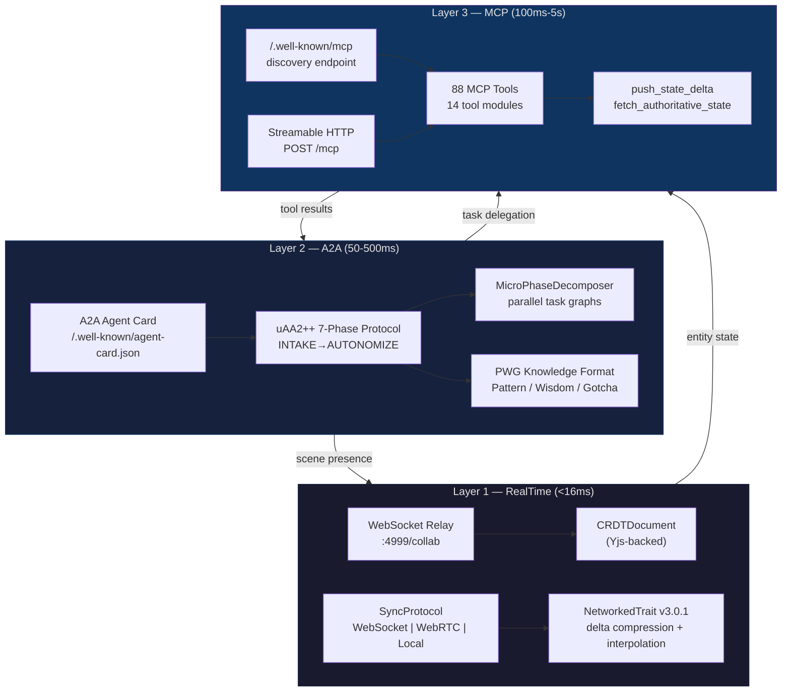
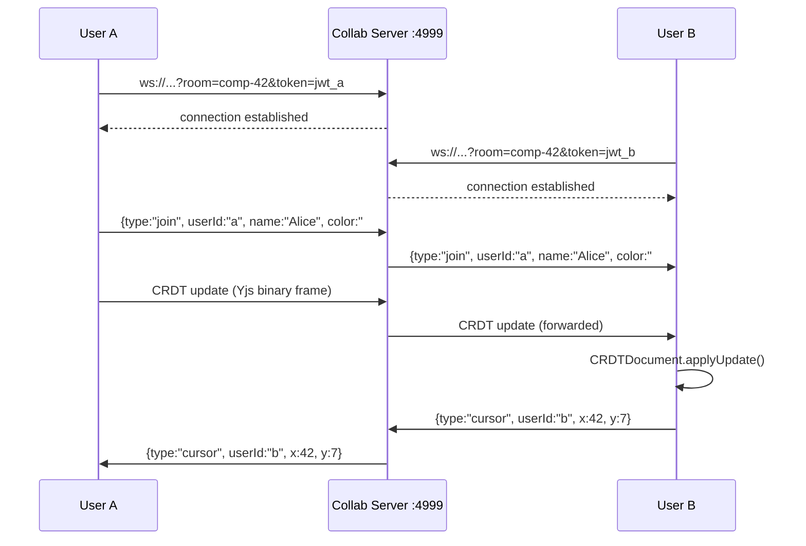
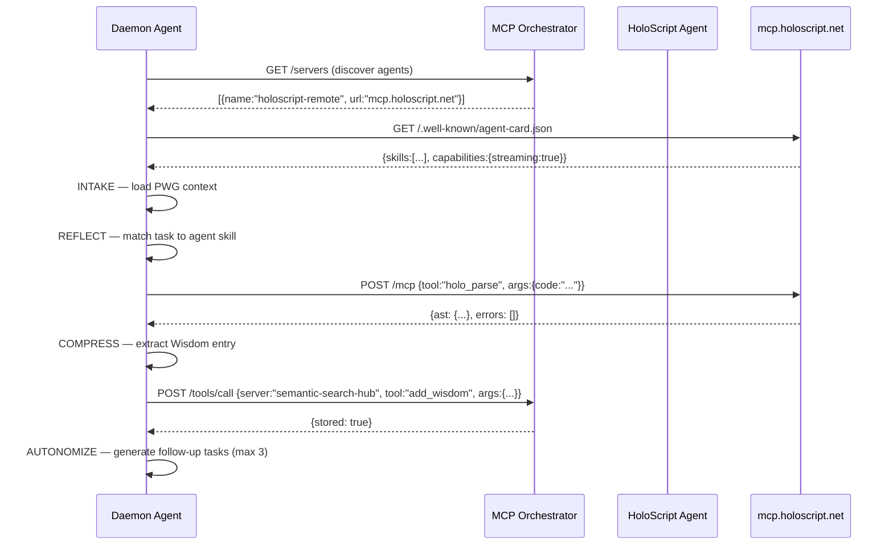
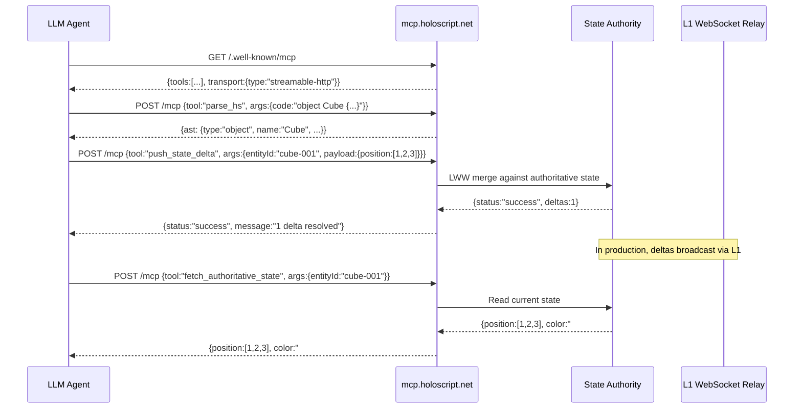

# HoloScript Communication Architecture — 3-Layer Specification

> **Date**: 2026-03-20 | **Source**: Direct source audit across 7 packages | **Status**: Implemented

HoloScript implements a 3-layer communication stack that covers real-time scene coordination, agent-to-agent task delegation, and tool discovery/invocation. Each layer operates independently but shares identity through uAA2 JWT tokens.

## Layer Overview

| Layer | Purpose | Transport | Latency | Source Package |
|-------|---------|-----------|---------|----------------|
| **L1: RealTime** | In-scene state sync, CRDT collaboration | WebSocket, WebRTC, BroadcastChannel | <16ms | `core/src/network/`, `collab-server/`, `core/src/collaboration/` |
| **L2: A2A** | Agent-to-agent task delegation | HTTP JSON-RPC, Agent Cards | 50–500ms | `agent-protocol/`, `core/src/compiler/A2AAgentCardCompiler.ts` |
| **L3: MCP** | Tool discovery and invocation | Streamable HTTP, JSON-RPC | 100ms–5s | `mcp-server/` (88 tools across 14 files) |

## Architecture Diagram



---

## Layer 1: RealTime — In-Scene State Synchronization

### Purpose

Sub-frame entity state replication for multi-user VR/AR experiences. Two subsystems handle different scopes: **SyncProtocol** for entity transforms (position, rotation, scale) and **CRDTDocument** for collaborative text editing (code, config).

### Transport Options

| Transport | File | Latency | Use Case |
|-----------|------|---------|----------|
| WebSocket | `SyncProtocol.ts:330–456` | 5–15ms | Default, works everywhere |
| WebRTC | `SyncProtocol.ts:458–559` | 1–5ms | Low-latency P2P, STUN via `stun.l.google.com:19302` |
| BroadcastChannel | `SyncProtocol.ts:561–623` | ~1ms | Same-origin tabs (local dev) |

**Auto-detection** (`NetworkedTrait.ts:280–329`): Attempts WebRTC first, falls back to WebSocket, then Local.

### SyncProtocol Configuration

```
Default batch window:   16ms    (SyncProtocol.ts:675)
Default update rate:    60Hz    (SyncProtocol.ts:674)
Distance culling:       100 units (SyncProtocol.ts:673)
Change threshold:       0.001   (SyncProtocol.ts:676)
Reconnect max attempts: 5       (WebSocketTransport, line 341)
Ping interval:          5000ms  (WebSocketTransport, line 434)
```

### Delta Encoding

`DeltaEncoder` (lines 109–259) tracks per-entity state versions and computes field-level diffs. Only changed fields are transmitted. Operations: `set`, `delete`, `increment`, `append`.

### Interest Management

`InterestManager` (lines 265–312) provides 3D spatial culling — entities beyond `distanceCulling` radius are not replicated to a given peer, reducing bandwidth proportional to scene density.

### NetworkedTrait Entity Sync

`NetworkedTrait` v3.0.1 (`core/src/traits/NetworkedTrait.ts`) attaches to any scene entity:

| Config | Value | Line |
|--------|-------|------|
| Sync modes | `owner`, `shared`, `server` | 29 |
| Channels | `reliable`, `unreliable`, `ordered` | 30 |
| Default sync rate | 20Hz | 245 |
| Interpolation delay | 100ms | 945 |
| Max extrapolation | 200ms | 947 |
| Snap threshold | 5 units | 948 |
| Buffer size | 10 samples | 481–484 |
| Quantization | configurable bits per float | SyncProperty:46 |

Interpolation modes: `linear`, `hermite`, `catmull-rom`. Quaternion slerp for rotations (lines 652–684).

### CRDT Collaborative Editing

`CRDTDocument` (`core/src/collaboration/CRDTDocument.ts`) provides Yjs-compatible text collaboration:

- One Yjs Doc per file, text-level CRDT (not AST)
- Binary frame: `[4B length][NB text][8B version]` (line 633)
- Undo/redo stack (max 100, capture timeout 500ms)
- Peer awareness: cursor, selection, world position, avatar ID
- Change debounce: 50ms

### Collaboration Server

`collab-server/src/server.ts` — WebSocket relay:

- **Endpoint**: `ws://host:4999/collab?room=<roomId>&token=<jwt>`
- **Auth**: JWT HS256 via `COLLAB_AUTH_SECRET` / `NEXTAUTH_SECRET`
- **Message types**: `join`, `cursor`, `leave`, `ping`
- **Broadcast**: All peers in room except sender

### Sequence: Two Users Editing a Composition



---

## Layer 2: A2A — Agent-to-Agent Protocol

### Purpose

Cross-agent task delegation using a structured lifecycle protocol. Agents advertise capabilities via Agent Cards (Google A2A spec) and execute work through the uAA2++ 7-phase cycle.

### uAA2++ 7-Phase Protocol

Defined in `packages/agent-protocol/src/index.ts`:

| # | Phase | Purpose |
|---|-------|---------|
| 0 | **INTAKE** | Load context, discover tools, authenticate |
| 1 | **REFLECT** | Analyze task, identify patterns from PWG knowledge |
| 2 | **EXECUTE** | Perform work, call tools |
| 3 | **COMPRESS** | Extract patterns, wisdom, gotchas from results |
| 4 | **REINTAKE** | Re-evaluate with new knowledge |
| 5 | **GROW** | Update capabilities, expand tool repertoire |
| 6 | **EVOLVE** | Architectural improvements, protocol upgrades |
| 7 | **AUTONOMIZE** | Self-directed task generation (max 3/cycle) |

**BaseAgent contract** (lines 65–143): Every agent implements `intake()`, `reflect()`, `execute()`, `compress()`, `reintake()`, `grow()`, `evolve()`. `runCycle(task, context)` orchestrates all phases sequentially.

### Agent Identity

```typescript
interface AgentIdentity {
  id: string;        // UUID
  name: string;      // e.g. "holoscript-daemon"
  domain: string;    // e.g. "holoscript"
  version: string;
  capabilities: string[];
}
```

### PWG Knowledge Interchange

Three knowledge types flow between agents during COMPRESS/REINTAKE:

| Type | ID Format | Key Fields | Example |
|------|-----------|------------|---------|
| **Pattern** | `P.DOMAIN.NN` | problem, solution, confidence (0–1) | `P.HS.042` — parser error handling |
| **Wisdom** | `W.DOMAIN.NN` | insight, context, source | `W.HS.127` — expression gap fix |
| **Gotcha** | `G.DOMAIN.NN` | mistake, fix, severity | `G.HS.004` — hand-crafted types |

### MicroPhaseDecomposer

`MicroPhaseDecomposer` (lines 411–533) breaks complex tasks into dependency graphs with topological sort and parallel execution groups. Default timeout: 30s per micro-phase.

### A2A Agent Card Compiler

`A2AAgentCardCompiler` (`core/src/compiler/A2AAgentCardCompiler.ts`) compiles `.holo`/`.hsplus` compositions into Google A2A Agent Cards:

- **Spec**: A2A Protocol v1.0.0 (Google, April 2025)
- **Well-known path**: `/.well-known/agent-card.json`
- **Extends** `CompilerBase` (line 239) with RBAC capability check
- **Compiles** 11 skill types from HoloScript constructs:
  - Templates, Objects, Logic blocks, Spatial, Domain blocks (13 domains), NPCs, Dialogues, Quests, Abilities, State machines, State blocks
- **Auto-generates** JSON-RPC interfaces for state/event access (lines 721–751)

### Sequence: Agent Task Delegation



---

## Layer 3: MCP — Model Context Protocol Tools

### Purpose

Standardized tool discovery and invocation for LLM agents. HoloScript exposes 88 tools across 14 modules via the MCP Streamable HTTP transport.

### Discovery Endpoint

`GET /.well-known/mcp` (`http-server.ts:297–338`) — ahead of the MCP specification (currently an active SEP, not yet finalized).

Response shape:
```json
{
  "mcpVersion": "2025-03-26",
  "name": "holoscript-mcp",
  "transport": {
    "type": "streamable-http",
    "url": "https://mcp.holoscript.net/mcp",
    "authentication": { "type": "bearer", "header": "Authorization" }
  },
  "capabilities": { "tools": { "count": 88 } },
  "tools": [{ "name": "parse_hs", "description": "..." }, ...],
  "endpoints": {
    "mcp": "https://mcp.holoscript.net/mcp",
    "health": "https://mcp.holoscript.net/health",
    "render": "https://mcp.holoscript.net/api/render",
    "share": "https://mcp.holoscript.net/api/share"
  }
}
```

### Tool Categories (88 tools, 14 modules)

| Module | Tools | Source |
|--------|-------|--------|
| **Core language** | `parse_hs`, `parse_holo`, `validate_holoscript`, `explain_code`, `analyze_code`, `convert_format` | `tools.ts`, `handlers.ts` |
| **Traits** | `list_traits` (1,800+), `explain_trait`, `suggest_traits` | `handlers.ts:285–340` |
| **Generators** | `generate_object`, `generate_scene` | `generators.ts` |
| **Compiler** | Compilation to 27 backend targets | `compiler-tools.ts` |
| **Graph analysis** | Scene graph traversal, dependency analysis | `graph-tools.ts`, `graph-rag-tools.ts` |
| **IDE integration** | LSP-adjacent tools for editors | `ide-tools.ts` |
| **Browser** | `browser_launch`, `browser_execute`, `browser_screenshot` | `browser/` |
| **Networking** | `push_state_delta`, `fetch_authoritative_state` | `networking-tools.ts` |
| **Monitoring** | Health, metrics, diagnostics | `monitoring-tools.ts` |
| **Self-improve** | Daemon orchestration, quality scoring | `self-improve-tools.ts` |
| **Testing** | `holoscript test` integration | `holotest-tools.ts` |
| **GLTF import** | 3D model ingestion | `gltf-import-tools.ts` |
| **Snapshots** | State capture and restore | `snapshot-tools.ts` |
| **Knowledge** | Wisdom/gotcha/pattern management | `wisdom-gotcha-tools.ts` |

### State Synchronization Tools

Two MCP tools bridge Layer 1 (RealTime) into Layer 3 (MCP), allowing LLM agents to participate in scene state:

**`push_state_delta`** — Push field-level changes with server-authoritative conflict resolution (last-write-wins):
```json
{
  "tool": "push_state_delta",
  "args": {
    "entityId": "cube-001",
    "payload": { "position": [1, 2, 3], "color": "#ff0000" }
  }
}
```

**`fetch_authoritative_state`** — Read the current truth for any entity, bypassing stale local caches:
```json
{
  "tool": "fetch_authoritative_state",
  "args": { "entityId": "cube-001" }
}
```

### Sequence: LLM Agent Modifying a Scene



---

## Cross-Layer Integration

### Identity Flow

All three layers share authentication through uAA2 JWT tokens:

| Layer | Auth Mechanism | Token Source |
|-------|---------------|--------------|
| L1 RealTime | `?token=<jwt>` query param on WebSocket | `COLLAB_AUTH_SECRET` / `NEXTAUTH_SECRET` |
| L2 A2A | `AgentIdentity.id` + RBAC capability check | `CompilerBase.getRBAC()` |
| L3 MCP | `Authorization: Bearer <token>` header | `MCP_API_KEY` env var |

### Layer Bridging

```
L1 ←→ L3:  networking-tools.ts bridges entity state between
           SyncProtocol (L1) and MCP tool calls (L3).
           LLM agents can push_state_delta to modify scenes
           that human users see in real-time.

L2 ←→ L3:  A2A agents discover tools via GET /.well-known/mcp (L3)
           and execute them through POST /mcp. The MCP orchestrator
           routes cross-server tool calls between registered agents.

L2 ←→ L1:  Agents set presence via CRDTDocument.setWorldPosition()
           and PeerAwareness. Agent avatars appear in-scene alongside
           human users.
```

---

## Failure Mode Table

| Failure | Affected Layer | Degradation | Recovery |
|---------|---------------|-------------|----------|
| WebSocket disconnect | L1 | Entity state freezes at last known position; local edits queue | Exponential backoff reconnect (5 attempts, 1s×2^n) |
| WebRTC ICE failure | L1 | Falls back to WebSocket transport automatically | Auto-detection chain in `NetworkedTrait.connect('auto')` |
| CRDT merge conflict | L1 | Text-level CRDT resolves automatically (Yjs guarantees convergence) | No manual intervention needed |
| Agent Card unavailable | L2 | Task delegation fails; agent operates in standalone mode | Orchestrator caches last-known card; retry on next cycle |
| uAA2++ phase failure | L2 | `CycleResult.status = 'partial'`; remaining phases skipped | PWG gotcha recorded; next cycle applies learned fix |
| MCP server down | L3 | Tool calls return errors; agents fall back to local parsing | Health check at `/health`; Railway auto-restart |
| State Authority corrupt | L3 | `push_state_delta` returns stale data | Disk-backed JSON rebuilt from authoritative source on restart |
| Auth token expired | All | Requests rejected with 401 | Token refresh via uAA2 service; lock file includes `spentUSD` for budget tracking |

---

## Comparison to 2026 MCP Standard

| Feature | MCP Spec (2025-11-25) | HoloScript Implementation | Status |
|---------|----------------------|---------------------------|--------|
| Streamable HTTP transport | Replaced SSE (2025-03-26) | `POST /mcp` with streaming support | Aligned |
| `.well-known/mcp` discovery | Active SEP (not yet finalized) | `http-server.ts:297` — full manifest + tool list | **Ahead of spec** |
| Tool invocation | JSON-RPC over HTTP | 88 tools via `handleTool()` dispatcher | Aligned |
| Resources | Resource templates + subscriptions | Not implemented (tools-only model) | Intentional gap |
| Prompts | Prompt templates | Not implemented | Intentional gap |
| Tasks primitive | Added in 2025-11-25 spec | Agent protocol handles task lifecycle at L2 | **Different layer** |
| MCP Registry | `registry.modelcontextprotocol.io` (preview) | MCP Orchestrator with 9 registered servers | **Ahead of spec** |
| Agent-optimized tools | Not in spec | `*_quick_*`, `*_batch_*`, `*_smart_*` prefixes in orchestrator | **Beyond spec** |
| Multi-server orchestration | Not in spec | IDEA protocol (Initialize/Discover/Execute/Affirm) | **Beyond spec** |
| Real-time state sync via MCP | Not in spec | `push_state_delta` / `fetch_authoritative_state` | **Beyond spec** |

### Key Differentiation

The MCP specification defines a single-layer tool protocol. HoloScript extends this into three layers:

1. **L1 fills the real-time gap** — MCP has no sub-second state sync. HoloScript's SyncProtocol + CRDT layer enables VR-grade entity replication that MCP alone cannot provide.

2. **L2 fills the agent coordination gap** — MCP defines tool discovery but not agent-to-agent delegation. The uAA2++ protocol + A2A Agent Cards provide a structured lifecycle for multi-agent systems.

3. **L3 aligns with MCP** while extending it with domain-specific capabilities (spatial state sync, 1,800+ VR traits, 27 compiler targets) that demonstrate how vertical MCP servers can specialize beyond generic tool providers.

---

## Source Files

| Component | Path | Lines |
|-----------|------|-------|
| SyncProtocol | `packages/core/src/network/SyncProtocol.ts` | 959 |
| NetworkedTrait | `packages/core/src/traits/NetworkedTrait.ts` | 1,073 |
| CRDTDocument | `packages/core/src/collaboration/CRDTDocument.ts` | 640+ |
| Collab Server | `packages/collab-server/src/server.ts` | 166 |
| Agent Protocol | `packages/agent-protocol/src/index.ts` | 534 |
| A2A Compiler | `packages/core/src/compiler/A2AAgentCardCompiler.ts` | 751 |
| MCP HTTP Server | `packages/mcp-server/src/http-server.ts` | 400+ |
| MCP Handlers | `packages/mcp-server/src/handlers.ts` | 1,000+ |
| Networking Tools | `packages/mcp-server/src/networking-tools.ts` | 167 |
