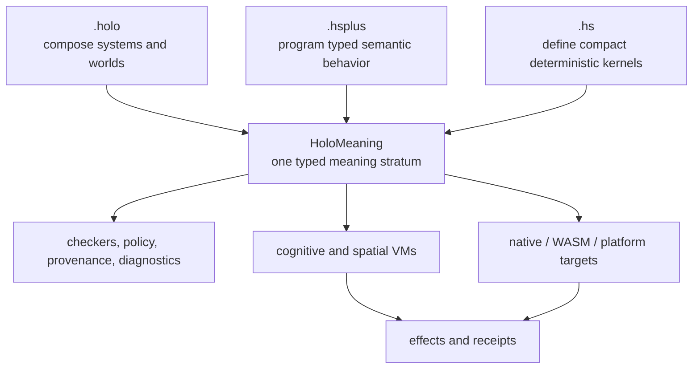

# Deep Research: HoloScript Syntax, Novelty, and Agent Efficiency

**Date:** 2026-07-23
**Status:** Evidence-backed language strategy; novelty hypotheses are deliberately narrower
than marketing claims
**Scope:** `.holo`, `.hsplus`, `.hs`, HoloMeaning, agent authoring efficiency, and native
epistemic execution

## Executive verdict

The founder's intuition is correct: **`.hsplus` should not be described as an "agent-brain
format."** Its strategically coherent role is a TypeScript-like, general-purpose semantic
programming language for services, interfaces, simulation, devices, economics, tools, state,
effects, and agents. Agent constructs should be first-class language features inside that
larger language, not the boundary of the language.

HoloScript's defensible novelty is also broader than any one token or extension. None of
these ingredients is individually unprecedented:

- multiple source representations,
- agent-oriented syntax,
- an `unknown` or missing value,
- a typed uncertainty carrier,
- effects and receipts,
- a spatial scene language, or
- lowering through an intermediate representation.

The stronger research hypothesis is their **integration**:

> HoloScript is building one epistemic execution contract across spatial composition,
> typed-general programming, agent behavior, shared meaning, and native machine strata.

That is a credible and interesting claim. It becomes a proven language contribution only
when all three formats lower without semantic loss into HoloMeaning, the execution layers
preserve those distinctions, and comparative benchmarks show an advantage for real agent
work.

The efficiency verdict is equally precise:

- HoloScript already has measured native parser latency and now has an allocation-free inline
  carrier for native known/unknown scalar fields.
- The current native carrier has a measurable space cost: 12 bytes for uncertain `bool` and
  `i32`, and 16 bytes for uncertain `i64`.
- On two larger single-host fixtures (5.3 KB and 8.3 KB), native Rust medians were 564.9 µs and
  822.2 µs versus JavaScript medians of 689.5 µs and 1,128.2 µs. The 434-byte result was mixed,
  Node/WASM was slower, and three fixture points are not an asymptotic performance proof.
- HoloScript has **not yet measured** fewer model tokens, fewer repair turns, lower total
  agent cost, or better task success than TypeScript, JSON, or YAML.

Therefore, "agent-efficient by design" is a fair design goal. "Proven more efficient for
agents" is not yet a fair result claim.

## 1. The language shape we should build toward

The three extensions should be treated as coordinated authoring surfaces, not three brands
for one drifting grammar.

| Surface | Primary authoring question | Language role | What must stay out of the role |
|---|---|---|---|
| `.holo` | What exists, how is it connected, and where does it run? | Declarative whole-system composition: worlds, scenes, interfaces, services, devices, dashboards, agents, and deployment topology | General algorithmic code duplicated inside composition files |
| `.hsplus` | How does the system behave? | General-purpose typed semantic programming: modules, values, records, functions, state, events, effects, traits, services, simulation, tools, and optional first-class agent constructs | Being reduced to prompts, brains, or one product vertical |
| `.hs` | What is the smallest deterministic contract or executable kernel? | Compact structural/logic/process core: auditable machine contracts, native kernels, transforms, and pipelines | Becoming a second full `.hsplus` with different spelling |

The intended relationship is:

This is a language family only if the arrows are real. Shared file extensions without
shared meaning would be a tool collection.

### The key `.hsplus` positioning

The useful analogy to TypeScript is not "copy TypeScript syntax." It is:

1. `.hsplus` is broad enough for ordinary application and systems logic.
2. Its type system makes semantic distinctions visible before execution.
3. Domain features—agents, traits, space, time, capabilities, effects, provenance—compose
   with the ordinary language rather than living in external JSON schemas.
4. It can target several runtimes without generated host-language code becoming the source
   of truth.

The differentiation from TypeScript should come from semantics and execution guarantees,
not unfamiliar punctuation.

## 2. Prior art: what HoloScript did not invent

### Typed uncertainty and absent knowledge

Bornholt, Mytkowicz, and McKinley's 2013
[`Uncertain<T>`](https://www.microsoft.com/en-us/research/publication/uncertaint-a-first-order-type-for-uncertain-data/)
work made uncertainty a first-order typed abstraction with probabilistic semantics.
HoloScript must not claim invention of the name or the general idea.

Other important neighboring models include:

- TypeScript's [`unknown`](https://www.typescriptlang.org/docs/handbook/release-notes/typescript-3-0.html#new-unknown-top-type),
  which is a static top type requiring narrowing, not a runtime epistemic state.
- Rust's [`Result<T, E>`](https://doc.rust-lang.org/core/result/index.html) and
  [`Option<T>`](https://doc.rust-lang.org/std/option/), which make error or absence explicit.
- Julia's [`missing`](https://docs.julialang.org/en/v1/manual/missing/), which propagates
  through opted-in operations and fails in control-flow positions that require a boolean.
- Terraform's
  [values not yet known](https://developer.hashicorp.com/terraform/language/expressions/references#values-not-yet-known),
  which propagate through planning expressions while retaining type information.
- CUE's
  [incomplete values](https://cuelang.org/docs/concept/working-with-incomplete-cue/) and
  [defaults](https://cuelang.org/docs/reference/spec/#default-values), which distinguish a
  valid partial specification from a concrete exportable value.
- HL7's
  [DataAbsentReason](https://terminology.hl7.org/CodeSystem-data-absent-reason.html), an
  example of domain-standardized reasons for absent data.

HoloScript's possible contribution is narrower: a non-probabilistic, reason-carrying
epistemic value whose honesty constraints survive source parsing, meaning lowering, native
layout, FFI, fallback control flow, and receipts.

### Agent-oriented and general-purpose agent languages

HoloScript is not the first language to make agents explicit:

- [Jason](https://jason-lang.github.io/jason/tutorials/getting-started/readme.html) provides
  AgentSpeak-based beliefs, plans, goals, guards, and
  [annotations](https://jason-lang.github.io/jason/tech/annotations.html).
- [SARL](https://www.sarl.io/docs/official/index.html) explicitly identifies itself as a
  general-purpose agent-oriented language and supports agents, behaviors, events,
  capacities, skills, and Java interoperability.
- Information-flow languages such as [Jif](https://www.cs.cornell.edu/jif/) make security
  policy part of typed programs.
- Effect systems such as [Koka](https://arxiv.org/abs/1406.2061) and
  [Flix](https://doc.flix.dev/effect-system.html) make computational effects explicit and
  checkable.

Consequently, "the first general-purpose agent language" is not defensible. A better
question is whether HoloScript unifies agent semantics with spatial composition, typed
effects, epistemic honesty, receipts, and sovereign multi-target execution more completely
than these systems.

### Structured language-model programming

Structured generation and model-program execution already have strong results:

- [LMQL](https://arxiv.org/abs/2212.06094) combines prompting, scripting, control flow, and
  constraints; its paper reports 26–85% cost savings on its evaluated workloads.
- [SGLang](https://arxiv.org/abs/2312.07104) combines a frontend language with runtime
  scheduling and cache optimizations; its paper reports up to 6.4x throughput on evaluated
  workloads.
- [TypeChat](https://github.com/microsoft/TypeChat) uses types and validation to translate
  natural language into structured application actions.
- [LangGraph StateGraph](https://langchain-ai.github.io/langgraphjs/reference/classes/langgraph.StateGraph.html)
  expresses agent workflows over typed shared state.

These results show why syntax-only comparisons are inadequate. Agent efficiency can come
from constrained decoding, cache reuse, validation, runtime scheduling, or fewer repair
loops. HoloScript needs measurements that isolate which mechanism provides its benefit.

### Multiple surfaces, shared IR, and spatial composition

Multiple representations and lowering are also established:

- Terraform supports native `.tf` syntax and
  [`.tf.json`](https://developer.hashicorp.com/terraform/language/syntax/json) as alternative
  configuration syntax.
- WebAssembly defines both
  [binary and text formats](https://webassembly.github.io/spec/core/).
- [MLIR dialect conversion](https://mlir.llvm.org/docs/DialectConversion/) formalizes
  legality, type conversion, and lowering between multiple dialects before
  [LLVM translation](https://mlir.llvm.org/docs/TargetLLVMIR/).
- OpenUSD separates several
  [file encodings](https://openusd.org/release/usdfaq.html) from its deeper
  [scene-description and composition model](https://openusd.org/dev/api/sdf_page_front.html).
- [A-Frame](https://aframe.io/docs/1.7.0/introduction/) makes 3D scene construction
  declarative in HTML.
- [Verse](https://dev.epicgames.com/documentation/en-us/uefn/verse-language-reference)
  is a general language connected to interactive worlds and gives
  [failure contexts](https://dev.epicgames.com/documentation/en-us/fortnite/basics-of-writing-code-9-failure-and-control-flow-in-verse)
  transactional control-flow meaning.

The number of HoloScript extensions is therefore not novel by itself. The research-worthy
property is **semantic specialization without semantic fragmentation**.

## 3. Claim ledger

| Candidate claim | Verdict | Evidence needed or available |
|---|---|---|
| `.hsplus` is broader than agent brains | **Supported as architecture and current product intent** | README and examples already name services, UI, simulation, devices, rendering, economics, tools, state machines, effects, and agents |
| HoloScript invented `Uncertain<T>` | **False / prior art** | Bornholt et al. used the name and probabilistic abstraction in 2013 |
| HoloScript invented unknown values | **False / prior art** | TypeScript, Julia, Terraform, CUE, databases, and many typed sum models precede it |
| HoloScript is the first general-purpose agent language | **False or at least indefensible** | SARL explicitly makes the same category claim; Jason and other agent languages predate both |
| Three extensions make HoloScript novel | **Unsupported** | Multiple syntaxes and encodings are common |
| Three specialized surfaces lowering into one typed meaning layer is novel | **Plausible composite-novelty hypothesis** | Requires completed cross-format lowering and a systematic literature comparison |
| Reason-carrying ignorance preserved into native ABI and receipts is novel | **Plausible narrow systems contribution** | Native `.hs` path is implemented; `.hsplus`, all backends, receipt propagation, and prior-art search must close |
| HoloScript is faster than TypeScript | **Unsupported as a general claim** | Existing parser benchmark is mixed and measures parsers, not end-to-end programs |
| HoloScript makes agents cheaper or more accurate | **Unmeasured** | Requires controlled model/task benchmark |
| Inline native `Uncertain<T>` is zero-cost | **False wording** | No heap allocation, but size and branch costs are nonzero |

## 4. Current efficiency evidence

### Parsing

The reproducible snapshot in
[`2026-04-19_todo-r2-wasm-bench-results.md`](./2026-04-19_todo-r2-wasm-bench-results.md)
measured three `.hsplus` fixtures on one host:

| Parser | 434 B | 5,297 B | 8,279 B |
|---|---:|---:|---:|
| Native Rust median | 44.8 µs | 564.9 µs | 822.2 µs |
| Node/WASM median after optimization | 84.0 µs | 1,078.2 µs | 1,701.5 µs |
| JavaScript median | 37.5–62.4 µs | 689.5 µs | 1,128.2 µs |

The native parser was competitive and scaled roughly linearly across those fixtures. The
WASM boundary erased that advantage. These are variance snapshots, not a universal or
cross-host benchmark.

### Native epistemic layout

Native machine contract `hs-machine-v34` uses an inline tagged carrier:

| Source field | Layout | Size | Alignment |
|---|---|---:|---:|
| `@unknown x: bool` | known tag + reason code + payload | 12 B | 4 B |
| `@unknown x: i32` | known tag + reason code + payload | 12 B | 4 B |
| `@unknown x: i64` | known tag + reason code + payload | 16 B | 8 B |

The carrier does not require a heap allocation. It preserves a stable known tag and
canonical reason code through aggregate copy, materialization, and FFI. It also prevents
payload use until source code explicitly resolves the value with `??`.

The cost is real:

- raw `i32` grows from 4 to 12 bytes;
- raw `i64` grows from 8 to 16 bytes;
- reads add a tag branch; and
- reason preservation adds four bytes.

For dense arrays, an Arrow-style
[validity bitmap](https://arrow.apache.org/docs/format/Columnar.html#validity-bitmaps) plus a
reason sidecar may be more compact. That is a benchmark candidate, not a conclusion: a
sidecar can save space but worsen locality and complicate FFI ownership.

### Agent authoring

There is no controlled evidence yet for:

- source tokens per completed task,
- first-pass parse or typecheck rate,
- semantic correctness after generation,
- number of model repair turns,
- total input/output tokens,
- wall-clock completion time, or
- dollar and energy cost.

These are the measurements needed before "efficient for agents" becomes a result.

## 5. The benchmark that can prove agent efficiency

### Corpus

Create 60 semantically identical tasks across six categories:

1. typed data transform,
2. service and API orchestration,
3. UI state and effects,
4. multi-agent delegation,
5. spatial scene behavior, and
6. native/device control with incomplete sensor data.

Provide each task in randomized language conditions:

- `.hsplus`,
- TypeScript with equivalent libraries,
- `.holo` or `.hs` where that surface is appropriate,
- JSON/YAML plus a host runtime, and
- one established agent DSL where a fair mapping exists.

Use at least three model families and freeze model/version, system prompt, temperature,
tool availability, and retry policy for each run.

### Primary metrics

| Dimension | Metric |
|---|---|
| Representation | UTF-8 bytes and tokens in source, schema, prompt, and repairs |
| Generation | first-pass parse, typecheck, and semantic-test success |
| Repair | repair turns and changed tokens until acceptance |
| Agent outcome | task success, unsafe action rate, false-known rate, and correct abstention rate |
| Compiler | parse/compile p50, p95, peak RSS, artifact size |
| Runtime | instruction count, allocations, wall time, FFI throughput |
| Human audit | time to locate an error and inter-rater correctness |

Report both **successful-task cost** and raw call cost. A terse language that needs repeated
repair can be less efficient overall.

### Epistemic ablation

Run each incomplete-information task twice:

- ordinary nullable/optional values; and
- reason-carrying HoloScript `@unknown`.

Measure:

- fabricated-value rate,
- premature side-effect rate,
- correct fallback rate,
- retained reason accuracy,
- task completion, and
- source/runtime overhead.

This directly tests the feature HoloScript is currently making executable.

### ABI experiment

Benchmark three physical representations:

1. current inline tag + reason + payload,
2. payload array + one-bit validity sidecar + reason sidecar, and
3. tagged union/reference representation.

Use scalar access, linear scans, random access, aggregate copy, FFI round-trip, and SIMD
batch operations. Report bytes per value and p50/p95 throughput. Do not select a winner from
size arithmetic alone.

## 6. Build sequence for the three formats

### Phase A — freeze the contracts

1. Give every surface a one-page normative role and explicit non-goals.
2. Keep one growing Rust/WASM grammar authority and a conformance corpus for every admitted
   construct.
3. Require every parser to emit a loss-accounting receipt: understood, preserved as opaque,
   or rejected. Silent token loss is forbidden.
4. Version HoloMeaning independently from surface spelling.

### Phase B — make `.hsplus` genuinely general-purpose

Prioritize ordinary programming completeness before adding more agent nouns:

1. modules and stable imports/exports,
2. records, interfaces, aliases, enums/unions, and type narrowing,
3. functions, closures, state, and deterministic initialization,
4. explicit async/effect boundaries,
5. structured errors and reason-carrying ignorance,
6. packages and a small portable standard library,
7. generics only where real programs demonstrate the need,
8. exhaustive matching and capability-aware diagnostics, and
9. backend conformance tests for every admitted feature.

Agents, brains, goals, tools, memory, and delegation then become libraries plus first-class
semantic constructs in this general language. They do not replace its ordinary core.

The first structural step is now present: the TypeScript `.hsplus` parser exposes field names,
types, and admitted annotations in its internal AST for `struct` declarations while retaining the
raw body for legacy consumers. The AST distinguishes admitted typed fields from preserved-opaque
members and retains optionality plus authored defaults. HoloMeaning consumes parser-produced
structured `@unknown` through a defensive shape-validating adapter that delegates to the canonical
struct-field lowering instead of reparsing raw text; type-syntax admission remains the parser's
responsibility.

The next blocker is executable native `.hsplus` lowering together with wider ordinary-programming
completeness. `compiler-native` still consumes only `.hs`; `interface` and `class` bodies remain
raw; and the Kotlin bridge rejects typed structs. This step establishes neither cross-backend
parity nor an agent-efficiency advantage.

### Phase C — keep `.hs` small and hard

Use `.hs` for the deterministic, auditable subset:

1. canonical records and scalar types,
2. transforms and pipelines,
3. explicit control flow,
4. machine-stable layout,
5. bounded effects,
6. reason-carrying unknown values, and
7. portable native/WASM execution.

Add a feature only when its semantics can be preserved on the strictest backend. This is
the surface agents can choose when auditability matters more than convenience.

### Phase D — make `.holo` the composition superpower

Use `.holo` to connect rather than duplicate:

1. named entities and containment,
2. spatial and interface topology,
3. services, devices, data sources, and agents,
4. deployment and runtime targets,
5. references to `.hsplus` behavior modules and `.hs` kernels,
6. policy/effect boundaries, and
7. provenance-preserving composition, overlays, and diffs.

The canonical parser now perceives `.holo` containment into shared meaning IR. Continue by
adding references and relationships with the same rule: no regex-derived shadow graph and no
new `.holo` construct without a downstream consumer.

### Phase E — close the cross-format loop

For each semantic feature, maintain a matrix:

| Feature | `.holo` | `.hsplus` | `.hs` | HoloMeaning | VM | native | receipt |
|---|---|---|---|---|---|---|---|
| Status | syntax / N/A / forbidden | syntax / N/A / forbidden | syntax / N/A / forbidden | lowered / opaque / rejected | preserved | preserved | evidenced |

No feature is "language-wide" until every relevant cell is green or deliberately marked
not applicable.

## 7. What the current implementation slice establishes

The native `.hs` slice for first-class ignorance now establishes:

- `@unknown` binds to exactly one typed struct field in the canonical Rust AST;
- legacy structs remain byte-for-byte unannotated at the AST contract;
- unknown fields require `known(value)` or `unknown("canonical_reason")`;
- five stable native reason codes are part of the ABI;
- bare load, raw store, borrow, raw constructor, and fallback laundering fail closed;
- `load(field) ?? fallback` reads payload only on the known branch;
- aggregate copy, materialization, and FFI preserve the carrier;
- malformed tags and reasons are rejected before payload use;
- Kotlin explicitly rejects the unsupported carrier instead of erasing it; and
- an executed fixture proves that the unknown branch does not perform the guarded mutation,
  while the known branch proceeds and exits with the expected code.

This is evidence for a narrow claim: **native HoloScript can preserve declared ignorance
instead of compiling it into a plausible lie.**

The adjacent `.hsplus` slice establishes structural parsing and canonical HoloMeaning lowering for
typed `struct` fields carrying `@unknown`, while preserving the legacy raw body. It does not
establish `.hsplus` native execution: `compiler-native` does not consume `.hsplus`, `interface` and
`class` bodies remain raw, and Kotlin rejects typed structs.

These slices are not yet evidence for `.hsplus` parity, probabilistic uncertainty, every native
type, every backend, or greater agent efficiency.

## 8. Public language that is safe now

Safe:

> HoloScript is developing three specialized authoring surfaces—composition, typed semantic
> programming, and compact deterministic execution—that converge on one meaning layer.

> `.hsplus` is being developed as a TypeScript-like general-purpose semantic language in which
> agents, traits, space, state, effects, and provenance are first-class rather than external
> schemas.

> HoloScript's native `.hs` path preserves known/unknown state and a stable reason code
> through layout, fallback control flow, copying, and FFI.

Still unsafe:

- "HoloScript invented `Uncertain<T>`."
- "HoloScript is the first general-purpose agent language."
- "HoloScript is more efficient than TypeScript."
- "Three formats are inherently novel."
- "The native uncertainty carrier is zero-cost."
- "All three formats already share every semantic feature."

## 9. Research conclusion

HoloScript does appear to contain more language novelty than "a DSL for agent brains." The
most promising contribution is a **general semantic programming language being developed within a
three-surface system**, with knowledge state, spatial composition, effects, provenance, and native
execution treated as parts of one contract.

The next six months should not maximize the count of syntax features. They should maximize:

1. semantic coverage shared across the three formats,
2. ordinary `.hsplus` programming completeness,
3. fail-closed lowering and backend parity,
4. end-to-end epistemic preservation, and
5. controlled evidence that agents finish tasks with fewer mistakes, repairs, tokens, or
   runtime resources.

That combination—if completed and measured—is the novelty story.
